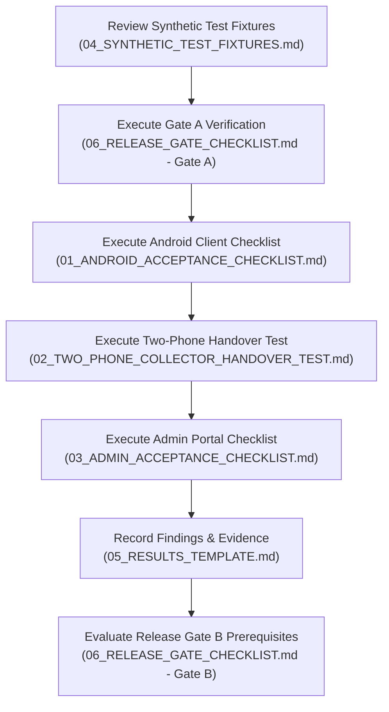

# Nutrition Study — version history and complete README archive

This file collects the preserved version history and full README snapshots in
one place. It is documentation, not a GitHub Release or an APK download.
For current operating instructions, start with [README.md](README.md).

## Important version distinctions

- **+6.2 is an admin-console verification/fix checkpoint.** It fixes long Study
  ID rounding in browser normalization, adds exact-digit regression tests, and
  records browser acceptance results. It is not a new installed phone APK.

- `+1` through `+6` are Android build/release labels used by this project.
  Earlier packages could override the build number during packaging, so a
  historical `pubspec.yaml` alone does not identify the distributed APK.
- **+6.1 is the admin-console/backend update**, not a new installed phone APK.
  The phone remains on the previously tested +6 build. Only the future collector
  display-name source was changed to +6.1; its package version was not advanced.
- The source commits below are verified repository checkpoints. Where an exact
  source-archive/APK pairing has not been established, this file says so.
- At the GitHub audit on 2026-09-27, there were no remote version tags or GitHub
  Releases. Source history is preserved in Git; distribution kits are separate.
  Do not treat the sections below as existing GitHub release tags.
- Original signing material, access keys, private collector QRs, backup recovery
  keys, and participant records must not be added to this archive or repository.
- Historical README text intentionally retains its original claims, placeholders,
  and limitations. It is **not current deployment guidance**. Do not run old
  LAN/HTTP examples against the public server.

## Version-by-version changelog

| Version | Purpose and recorded changes | Documentation/source evidence | Artifact qualification |
| --- | --- | --- | --- |
| +1 | Early collector/admin project and retained Android distribution baseline. | Initial README checkpoint `43f2949`; first-phone guide later records retained +1 artifacts. | Exact released APK/source pairing not established by this archive. |
| +2 | Shared collector app; runtime collector identity/key; latest-login session model; local home-PC sync; isolated Windows first-phone guide and separate admin site. | First-phone checkpoint `7d4f351`; related implementation `8c7e642`; `tool/FIRST_PHONE_TEST.md`. | The guide explicitly identifies `study-collector-1.0.0+2.apk`; source checkpoint is not a retroactive version tag. |
| +3 | Preserved intermediate local-sync release; nearby history includes survey draft recovery, validation and integrity safeguards. | Related source checkpoint `d71a0df`; WSL operator README names +3 as an upgrade target. | A distinct +3 README and exact APK-to-commit pairing have not been verified. The related checkpoint is included in full, not invented as an exact release snapshot. |
| +4 | WSL2 operator kit with versioned imports, persistent shared state/credentials, lifecycle controls and survey validation. | Implementation checkpoint `6661b6d`; full `tool/wsl/README.md` below. | Exact artifact manifest mapping remains to be reconciled; versioned build labels do not imply separate data directories. |
| +5 | Public-VPS deployment path, HTTPS requirements, collector/admin separation, authentication and proxy hardening, safe restore/activation tooling, acceptance kit and encrypted offsite-backup work. | Historical root README `155fed6`; PLUS5 reports and VPS/acceptance READMEs. | +5 documentation spans several checkpoints: early pending-domain reports and later live deployment records must not be conflated. |
| +6 | Mandatory first-time QR sign-in; no manual collector/server/key fields in public login; camera permissions and lifecycle handling; payload validation; portrait requests and secure session restoration. | Source checkpoint `d757dc0`; `tool/acceptance/PLUS6_QR_VERIFICATION.md`. | Tested side-by-side package `org.nutritionstudy.project2.plus5test`, version code 6. No normal production +6 APK was included in the +6 test kit. |
| Admin +6.1 | Replaced production browser-memory collector management with server-backed accounts; private QR generation; disable/reset-session actions; persistence and fail-closed credential-store loading; preserved existing Collector 1 key. | Source checkpoint `8cbf091`; admin handoff below. | Admin/backend release only; no new phone APK built or installed. 24 focused tests, analysis and admin web build passed at this checkpoint. |

### +6.1 deployed checkpoint

Recorded deployment on 2026-09-26:
`20260926T145831Z-76b4c5ccba4b`.
The rollout health check reported one retained synthetic record and healthy
backend status. Live verification checked the safe collector list, no-store
Collector 1 QR response, unchanged Collector 1 credential, and admin HTTPS.
This describes the recorded checkpoint; it is not a fresh live-health assertion.

The new `collector_accounts.json` file is sensitive operational state, not source.
Its directory is protected and its Linux file mode is 0600. State backups must
remain encrypted. QR images grant collector access and must be shown privately.

### Recorded acceptance and remaining work

The +6 targeted verification recorded 50 passing automated tests. Subsequent
user-assisted single-phone checks confirmed portrait behaviour, background/reopen,
camera permission denial and recovery, invalid-QR rejection, valid QR sign-in,
and retained synced data. Those later confirmations are separate from the older
README snapshots below.

At the +6.1 checkpoint, 24 focused backend/admin tests passed, static analysis
reported no issues, and the release admin web build succeeded. Full live browser
acceptance, two-phone latest-login takeover, scheduled-backup observation,
retention policy, and the final standard collector release remained to be
completed. Passing a subset does not authorize real participant collection.

## Documentation index

- [Current root README](README.md)
- [First phone guide (+2 baseline)](tool/FIRST_PHONE_TEST.md)
- [WSL operator README](tool/wsl/README.md)
- [VPS operator README](tool/vps/README.md)
- [Acceptance-kit README](tool/acceptance/README.md)
- [Historical +5 pre-deployment report](PLUS5_PREDEPLOYMENT_REPORT.md)
- [Historical +5 integration handoff](PLUS5_INTEGRATION_HANDOFF.md)
- [Historical +5 private setup checkpoint](PLUS5_PRIVATE_SETUP_CHECKPOINT.md)
- [Historical +5 server checkpoint](PLUS5_SERVER_CHECKPOINT.md)
- [+6 QR verification](tool/acceptance/PLUS6_QR_VERIFICATION.md)
- [Admin +6.1 verification/Agy handoff](tool/acceptance/ADMIN_6_1_AGY_HANDOFF.md)

## Full historical root READMEs

The following are complete, unabridged snapshots retrieved from Git, not newly
written release descriptions. +2/+3/+4 related checkpoints contain identical root
README text, but are retained separately to make that historical fact explicit.
Links inside copied text retain their original spelling; use each source link
for correctly resolved historical links.

### Initial / +1-related checkpoint — 43f2949

[Original README at this commit](https://github.com/mrsneaky29/Nutrition-Study/blob/43f2949/README.md)

<details>
<summary>Read the complete README</summary>

# Project2

Project2 has two deliberately separate clients:

- a collector app for Android phones and mobile browsers (`lib/main.dart`);
- a browser-only administration portal (`lib/admin_main.dart`).

The collector app does not contain an admin route or admin login. It includes
a compact, custom interviewer-entered NCD-risk questionnaire for adults 18+:
demographics, tobacco/alcohol, diet, activity, sleep, reported diagnoses, and
height, weight, waist, and two blood-pressure readings. It borrows the shape
of established surveillance tools but is not a WHO STEPS implementation.

Participant name and phone are retained only for the operational repeat-visit
workflow. Questionnaire CSV exports use the study ID and deliberately omit
those direct identifiers.

Collector submissions are retained across app restarts in encrypted Android
storage. Pending and failed submissions remain available for manual retry while
the production cloud synchronization layer is still disconnected.

## Local collector app

Connect an Android phone by USB or wireless debugging, then run:

```powershell
flutter run -d <device-id> -t lib/main.dart
```

Local demo account:

- collector number: `1`

## Local admin webpage

Run the independent web entrypoint in Chrome:

```powershell
flutter run -d chrome -t lib/admin_main.dart
```

The admin portal reads from the local LAN adapter by default. Its Firebase
session and collector-account adapters are implemented; the Firebase visit
repository and hosted sign-in screen remain to be connected.

## Firebase collector build

The production collector selects Firebase explicitly and fails at startup when
any deployment value is missing:

```powershell
flutter build apk --release -t lib/main.dart `
  --dart-define=STUDY_RUNTIME_MODE=firebase-production `
  --dart-define=STUDY_ID=nutrition-study-2026 `
  --dart-define=FIREBASE_API_KEY=<web-api-key> `
  --dart-define=FIREBASE_APP_ID=<firebase-app-id> `
  --dart-define=FIREBASE_MESSAGING_SENDER_ID=<sender-id> `
  --dart-define=FIREBASE_PROJECT_ID=nutrition-study-2026 `
  --dart-define=FIREBASE_AUTH_DOMAIN=nutrition-study-2026.firebaseapp.com `
  --dart-define=FIREBASE_FUNCTIONS_REGION=asia-south1
```

Do not distribute a Firebase production build until one test collector has
completed phone-to-admin synchronization in the deployed project.

## Collector and admin websites

Build both independently so the collector and administrator entrypoints can be
hosted at different addresses:

```powershell
powershell -ExecutionPolicy Bypass -File tool/build_web_clients.ps1
```

For a LAN-only demo in which both websites use the disposable local record
service, supply its URL and matching development key:

```powershell
powershell -ExecutionPolicy Bypass -File tool/build_web_clients.ps1 `
  -LocalApiBaseUrl http://<computer-wifi-ip>:8787 `
  -LocalApiKey <at-least-16-character-private-key>
```

The outputs are `build/collector_web` and `build/admin_web`. The collector build
is an installable mobile web app. For low-memory local previews, serve either
already-built directory with the dependency-free Node server:

```powershell
node tool/static_site_server.js --root=build/collector_web --port=8085
node tool/static_site_server.js --root=build/admin_web --port=8086
```

Firebase Hosting has separate `collector` and `admin` targets configured in
`firebase.json`. Their actual Firebase site IDs will be assigned after the
Firebase project and billing account are available.

## Shared local records

For phone submissions to appear in the admin webpage, start the disposable LAN
bridge with a private development key:

```powershell
$env:LOCAL_SYNC_KEY='<at-least-16-character-private-key>'
dart run tool/local_sync_server.dart --host=<computer-wifi-ip> --port=8787
```

Build or run both clients with the matching key and service address:

```powershell
flutter run -d <device-id> -t lib/main.dart --dart-define=LOCAL_API_BASE_URL=http://<computer-wifi-ip>:8787 --dart-define=LOCAL_API_KEY=<private-key>
flutter run -d chrome -t lib/admin_main.dart --dart-define=LOCAL_API_BASE_URL=http://<computer-wifi-ip>:8787 --dart-define=LOCAL_API_KEY=<private-key>
```

This bridge is for a trusted local network only. Its isolated files and removal
steps are documented in `tool/LOCAL_SYNC.md`.

## Verification

```powershell
flutter analyze
flutter test
flutter build apk --debug -t lib/main.dart
flutter build web -t lib/admin_main.dart
```

## Android release package

Release builds use a private upload/signing key at
`android/app/study-release.jks` with credentials in
`android/key.properties`. Both files are ignored by source control. Back up
both files securely: Android and Google Play updates must be signed with the
same key.

Create the signing key once:

```powershell
powershell -ExecutionPolicy Bypass -File tool/create_release_signing.ps1
```

The command also creates a private ignored backup directory. Never distribute
that directory with the APK or commit it to source control.

Create both the directly installable APK and Play Store App Bundle with:

```powershell
powershell -ExecutionPolicy Bypass -File tool/package_android_release.ps1 `
  -BuildName 1.0.0 -BuildNumber 1
```

Versioned artifacts and their SHA-256 checksums are written to `dist/android`.
Increase `BuildNumber` for every distributed update.

</details>

### First-phone / +2-related checkpoint — 7d4f351

[Original README at this commit](https://github.com/mrsneaky29/Nutrition-Study/blob/7d4f351/README.md)

<details>
<summary>Read the complete README</summary>

# Project2

Project2 has two deliberately separate clients:

- a collector app for Android phones and mobile browsers (`lib/main.dart`);
- a browser-only administration portal (`lib/admin_main.dart`).

The collector app does not contain an admin route or admin login. It includes
a compact, custom interviewer-entered NCD-risk questionnaire for adults 18+:
demographics, tobacco/alcohol, diet, activity, sleep, reported diagnoses, and
height, weight, waist, and two blood-pressure readings. It borrows the shape
of established surveillance tools but is not a WHO STEPS implementation.

Participant name and phone are retained only for the operational repeat-visit
workflow. Questionnaire CSV exports use the study ID and deliberately omit
those direct identifiers.

Collector submissions are retained across app restarts in encrypted Android
storage. Pending and failed submissions remain available for manual retry while
the production cloud synchronization layer is still disconnected.

## Local collector app

Connect an Android phone by USB or wireless debugging, then run:

```powershell
flutter run -d <device-id> -t lib/main.dart
```

Local demo account:

- collector number: `1`

## Local admin webpage

Run the independent web entrypoint in Chrome:

```powershell
flutter run -d chrome -t lib/admin_main.dart
```

The admin portal reads from the local LAN adapter by default. Its Firebase
session and collector-account adapters are implemented; the Firebase visit
repository and hosted sign-in screen remain to be connected.

## Firebase collector build

The production collector selects Firebase explicitly and fails at startup when
any deployment value is missing:

```powershell
flutter build apk --release -t lib/main.dart `
  --dart-define=STUDY_RUNTIME_MODE=firebase-production `
  --dart-define=STUDY_ID=nutrition-study-2026 `
  --dart-define=FIREBASE_API_KEY=<web-api-key> `
  --dart-define=FIREBASE_APP_ID=<firebase-app-id> `
  --dart-define=FIREBASE_MESSAGING_SENDER_ID=<sender-id> `
  --dart-define=FIREBASE_PROJECT_ID=nutrition-study-2026 `
  --dart-define=FIREBASE_AUTH_DOMAIN=nutrition-study-2026.firebaseapp.com `
  --dart-define=FIREBASE_FUNCTIONS_REGION=asia-south1
```

Do not distribute a Firebase production build until one test collector has
completed phone-to-admin synchronization in the deployed project.

## Collector and admin websites

Build both independently so the collector and administrator entrypoints can be
hosted at different addresses:

```powershell
powershell -ExecutionPolicy Bypass -File tool/build_web_clients.ps1
```

For local previews, run the script without collector-specific parameters. Its
older optional keyed-build parameters are not part of the shared-APK release
flow. The separate admin website asks for its key at runtime.

The outputs are `build/collector_web` and `build/admin_web`. The collector build
is an installable mobile web app. For low-memory local previews, serve either
already-built directory with the dependency-free Node server:

```powershell
node tool/static_site_server.js --root=build/collector_web --port=8085
node tool/static_site_server.js --root=build/admin_web --port=8086
```

Firebase Hosting has separate `collector` and `admin` targets configured in
`firebase.json`. Their actual Firebase site IDs will be assigned after the
Firebase project and billing account are available.

## Shared local records

For phone submissions to appear in the admin webpage, start the LAN service
with distinct collector keys and a separate administrator key (minimum 16 characters each).

> [!CAUTION]
> **Security Notice**: Cleartext LAN HTTP (`http://<ip>:8787`) and bearer keys are designed
> **strictly for trusted home or local Wi-Fi networks**. They are **NOT suitable for public internet
> exposure**. Never expose this service directly to the public internet.

### Collector Credential Binding & Server Start-Up

Collector credentials bind each bearer key to an explicit collector identity:
- Format: `LOCAL_SYNC_COLLECTOR_KEYS=C001:key1,C002:key2` (each key >= 16 characters).
- The server derives the authorized collector identity from the key; incoming upload payloads must match this `collectorId` or the server rejects the request.
- The administrator key is configured via `LOCAL_SYNC_ADMIN_KEY` (minimum 16 characters) and is **strictly entered at runtime** in the browser.

#### PowerShell (Windows):

Replace every angle-bracketed value below with a different, privately generated secret before starting the server; the text shown is not a usable credential.

```powershell
$env:LOCAL_SYNC_COLLECTOR_KEYS = "C001:<unique-random-secret-for-collector-1>,C002:<unique-random-secret-for-collector-2>"
$env:LOCAL_SYNC_ADMIN_KEY = "<unique-random-admin-secret>"
dart run tool/local_sync_server.dart --host=<computer-wifi-ip> --port=8787
```

#### Bash (Linux / macOS):

```bash
export LOCAL_SYNC_COLLECTOR_KEYS="C001:<unique-random-secret-for-collector-1>,C002:<unique-random-secret-for-collector-2>"
export LOCAL_SYNC_ADMIN_KEY="<unique-random-admin-secret>"
dart run tool/local_sync_server.dart --host=<computer-wifi-ip> --port=8787
```

### Collector Sign-In & Offline Safety

Install the same collector APK on each phone. On the sign-in screen, a
collector enters their assigned number (for example, `1`), the home-PC server
URL, and their access key. These details are not embedded in the APK. A
successful sign-in on another phone becomes the current session for that
collector; there is no permanent device binding. The previous phone cannot
sync under its superseded session. Its unsynced records stay on that phone,
so recover and sync them before replacing or clearing the device. Explicit
sign-out clears the saved collector key and session token, not visit records.

```powershell
# Collector app: enter server URL, collector number, and key on screen.
flutter run -d <device-id> -t lib/main.dart

# Admin web portal (prompts for admin key interactively at runtime in the browser):
flutter run -d chrome -t lib/admin_main.dart `
  --dart-define=LOCAL_API_BASE_URL=http://<computer-wifi-ip>:8787
```

Field staff can collect while offline after setup. Submitted records are saved
in Android secure storage. When the configured home-PC endpoint becomes
reachable, the app retries pending submissions while it is open and active;
the endpoint is not discovered automatically.

### Participant ID Scheme & Repeat Visits

- **Collision-safe Study IDs (No 200 Limit)**: The app generates a new Study ID from the collector prefix and a random 16-digit suffix, such as `C01-4827163094582731`, rather than a per-phone sequence. The same collector can therefore switch phones without suggesting the same next ID. The server still checks for collisions at sync time. Legacy `C01-000001` and `P001` IDs remain valid for existing participants. Study IDs are separate from the simple visit number shown for repeat visits.
- **Online Repeat-Visit Lookup (`GET /participants/lookup`)**: When the configured server is reachable, collectors can look up participants by phone number to verify study IDs and prior visits.
- **Offline Repeat Visits**: Verify the participant's prior Study ID using the study's physical records or study card and enter it for Visit 2+. The app does not issue study cards or guarantee correct linking for a mistyped ID.

### Sync-Window Workflow (2–3 Hours/Day)

The home-PC server does not need to run continuously. A 2–3 hour daily window
may work if every collector returns, keeps the app active until pending sync reaches zero, and the administrator verifies a backup:
- **During the day**: Field collectors work offline. Visits are securely stored in encrypted local storage on each phone.
- **During the sync window**: Collectors connect to the local Wi-Fi network, open the app, and wait for pending visits to sync with the configured home-PC server.
- **Idempotency**: Retries and network drops are handled transparently using persistent idempotency keys without duplicate records or overwriting admin corrections.

### Real Server Conflict Inbox (`/conflicts`) & Admin Resolution

- Discrepancies (such as `participant_mismatch`, `duplicate_visit`, or `idempotency_collision`) return HTTP 409 Conflict and are stored in the server conflict inbox at `/conflicts` (`.local_data/conflicts.json`).
- On the phone, conflicting records remain locally stored with a **Sync conflict** state, and automatic retries are paused.
- In the Admin Portal (`lib/admin_main.dart`), administrators review conflicts in the **Sync conflicts** tab and resolve mismatches using the review controls. Verify the result against the retained phone copy.

### Off-Device Backups & Disaster Recovery

The automatic `.local_data/records.json.bak` snapshot is on the same disk and is
**not** an off-device backup. Drive failure or system corruption will destroy both files.
Use the official backup utility (`tool/backup_utility.ps1` or `tool/backup_utility.dart`) to create cryptographic SHA-256 verified off-device backups to an external USB drive or network share:

Stop the sync server after all phones have synced and before backing up. On Windows, the command rejects destinations it cannot identify as removable, USB-attached, or remote network storage; a same-PC fixed-disk path is not accepted.

- **Backup (post-sync window)**:
  ```powershell
  powershell -ExecutionPolicy Bypass -File tool/backup_utility.ps1 -Action Backup -Destination "E:\StudyBackups"
  ```
- **Verify integrity**:
  ```powershell
  powershell -ExecutionPolicy Bypass -File tool/backup_utility.ps1 -Action Verify -BackupPath "E:\StudyBackups\backup_20260923_180000"
  ```
- **Safe restore**:
  ```powershell
  powershell -ExecutionPolicy Bypass -File tool/backup_utility.ps1 -Action Restore -BackupPath "E:\StudyBackups\backup_20260923_180000" -ConfirmOverwrite
  ```
- **Recover after an interrupted restore, before restarting the server**:
  ```powershell
  powershell -ExecutionPolicy Bypass -File tool/backup_utility.ps1 -Action Recover -Target ".local_data"
  ```
- **Automated self-test**:
  ```powershell
  powershell -ExecutionPolicy Bypass -File tool/backup_utility.ps1 -Action SelfTest
  ```

*(Direct Dart alternatives: `dart run tool/backup_utility.dart backup|verify|restore|test`)*.

If the primary `records.json` is corrupted on disk, the server automatically recovers from `.local_data/records.json.bak`. For full operator instructions, see [BACKUP_INSTRUCTIONS.md](tool/BACKUP_INSTRUCTIONS.md) and [LOCAL_SYNC.md](tool/LOCAL_SYNC.md).

## Verification

```powershell
flutter analyze
flutter test
flutter build apk --debug -t lib/main.dart
flutter build web -t lib/admin_main.dart
```

## Android release package

Release builds use a private upload/signing key at
`android/app/study-release.jks` with credentials in
`android/key.properties`. Both files are ignored by source control. Back up
both files securely: Android and Google Play updates must be signed with the
same key.

Create the signing key once:

```powershell
powershell -ExecutionPolicy Bypass -File tool/create_release_signing.ps1
```

The command also creates a private ignored backup directory on this computer. Copy both backup files to a separate secure location before distributing an APK; a same-disk backup will not survive PC failure. Never distribute the signing files with the APK or commit them to source control.

Create both the directly installable APK and Play Store App Bundle with:

```powershell
powershell -ExecutionPolicy Bypass -File tool/package_android_release.ps1 `
  -BuildName 1.0.0 -BuildNumber 1 -SigningBackupConfirmed
```

For a LAN-connected collector package, you may include a default home-PC
service address, but not a collector key or collector identity:

```powershell
powershell -ExecutionPolicy Bypass -File tool/package_android_release.ps1 `
  -BuildName 1.0.0 -BuildNumber 1 `
  -LocalApiBaseUrl http://<computer-wifi-ip>:8787 `
  -SigningBackupConfirmed
```

The optional service address is a default, not a device assignment. Collectors
enter their own number and key at runtime and can change phones by signing in
on the new phone. A private Wi-Fi service address works only while the phone
can reach that network; this LAN configuration is not a public-internet sync
service.

Versioned artifacts and their SHA-256 checksums are written to
`dist/android/shared/`. The script refuses to replace prior artifacts. Increase
`BuildNumber` for every update, and retain the same signing key and
application ID. The same APK can be installed on every collector phone.

Assign collector numbers and matching server keys to people, not phones. Each
person enters their number and key when signing in; the most recent successful
sign-in takes over that collector session. The switch
`-SigningBackupConfirmed` is an acknowledgement, not an automated backup
check: do not use it until both signing files have been copied off this PC and
verified. The generic login and collision-safe ID paths have automated tests;
before real-data distribution, configure the actual home-PC server and admin
portal, verify an off-PC participant-data backup and restore, and run an
offline-to-sync trial on more than one physical phone.

</details>

### Intermediate / +3-related checkpoint (not exact release mapping) — d71a0df

[Original README at this commit](https://github.com/mrsneaky29/Nutrition-Study/blob/d71a0df/README.md)

<details>
<summary>Read the complete README</summary>

# Project2

Project2 has two deliberately separate clients:

- a collector app for Android phones and mobile browsers (`lib/main.dart`);
- a browser-only administration portal (`lib/admin_main.dart`).

The collector app does not contain an admin route or admin login. It includes
a compact, custom interviewer-entered NCD-risk questionnaire for adults 18+:
demographics, tobacco/alcohol, diet, activity, sleep, reported diagnoses, and
height, weight, waist, and two blood-pressure readings. It borrows the shape
of established surveillance tools but is not a WHO STEPS implementation.

Participant name and phone are retained only for the operational repeat-visit
workflow. Questionnaire CSV exports use the study ID and deliberately omit
those direct identifiers.

Collector submissions are retained across app restarts in encrypted Android
storage. Pending and failed submissions remain available for manual retry while
the production cloud synchronization layer is still disconnected.

## Local collector app

Connect an Android phone by USB or wireless debugging, then run:

```powershell
flutter run -d <device-id> -t lib/main.dart
```

Local demo account:

- collector number: `1`

## Local admin webpage

Run the independent web entrypoint in Chrome:

```powershell
flutter run -d chrome -t lib/admin_main.dart
```

The admin portal reads from the local LAN adapter by default. Its Firebase
session and collector-account adapters are implemented; the Firebase visit
repository and hosted sign-in screen remain to be connected.

## Firebase collector build

The production collector selects Firebase explicitly and fails at startup when
any deployment value is missing:

```powershell
flutter build apk --release -t lib/main.dart `
  --dart-define=STUDY_RUNTIME_MODE=firebase-production `
  --dart-define=STUDY_ID=nutrition-study-2026 `
  --dart-define=FIREBASE_API_KEY=<web-api-key> `
  --dart-define=FIREBASE_APP_ID=<firebase-app-id> `
  --dart-define=FIREBASE_MESSAGING_SENDER_ID=<sender-id> `
  --dart-define=FIREBASE_PROJECT_ID=nutrition-study-2026 `
  --dart-define=FIREBASE_AUTH_DOMAIN=nutrition-study-2026.firebaseapp.com `
  --dart-define=FIREBASE_FUNCTIONS_REGION=asia-south1
```

Do not distribute a Firebase production build until one test collector has
completed phone-to-admin synchronization in the deployed project.

## Collector and admin websites

Build both independently so the collector and administrator entrypoints can be
hosted at different addresses:

```powershell
powershell -ExecutionPolicy Bypass -File tool/build_web_clients.ps1
```

For local previews, run the script without collector-specific parameters. Its
older optional keyed-build parameters are not part of the shared-APK release
flow. The separate admin website asks for its key at runtime.

The outputs are `build/collector_web` and `build/admin_web`. The collector build
is an installable mobile web app. For low-memory local previews, serve either
already-built directory with the dependency-free Node server:

```powershell
node tool/static_site_server.js --root=build/collector_web --port=8085
node tool/static_site_server.js --root=build/admin_web --port=8086
```

Firebase Hosting has separate `collector` and `admin` targets configured in
`firebase.json`. Their actual Firebase site IDs will be assigned after the
Firebase project and billing account are available.

## Shared local records

For phone submissions to appear in the admin webpage, start the LAN service
with distinct collector keys and a separate administrator key (minimum 16 characters each).

> [!CAUTION]
> **Security Notice**: Cleartext LAN HTTP (`http://<ip>:8787`) and bearer keys are designed
> **strictly for trusted home or local Wi-Fi networks**. They are **NOT suitable for public internet
> exposure**. Never expose this service directly to the public internet.

### Collector Credential Binding & Server Start-Up

Collector credentials bind each bearer key to an explicit collector identity:
- Format: `LOCAL_SYNC_COLLECTOR_KEYS=C001:key1,C002:key2` (each key >= 16 characters).
- The server derives the authorized collector identity from the key; incoming upload payloads must match this `collectorId` or the server rejects the request.
- The administrator key is configured via `LOCAL_SYNC_ADMIN_KEY` (minimum 16 characters) and is **strictly entered at runtime** in the browser.

#### PowerShell (Windows):

Replace every angle-bracketed value below with a different, privately generated secret before starting the server; the text shown is not a usable credential.

```powershell
$env:LOCAL_SYNC_COLLECTOR_KEYS = "C001:<unique-random-secret-for-collector-1>,C002:<unique-random-secret-for-collector-2>"
$env:LOCAL_SYNC_ADMIN_KEY = "<unique-random-admin-secret>"
dart run tool/local_sync_server.dart --host=<computer-wifi-ip> --port=8787
```

#### Bash (Linux / macOS):

```bash
export LOCAL_SYNC_COLLECTOR_KEYS="C001:<unique-random-secret-for-collector-1>,C002:<unique-random-secret-for-collector-2>"
export LOCAL_SYNC_ADMIN_KEY="<unique-random-admin-secret>"
dart run tool/local_sync_server.dart --host=<computer-wifi-ip> --port=8787
```

### Collector Sign-In & Offline Safety

Install the same collector APK on each phone. On the sign-in screen, a
collector enters their assigned number (for example, `1`), the home-PC server
URL, and their access key. These details are not embedded in the APK. A
successful sign-in on another phone becomes the current session for that
collector; there is no permanent device binding. The previous phone cannot
sync under its superseded session. Its unsynced records stay on that phone,
so recover and sync them before replacing or clearing the device. Explicit
sign-out clears the saved collector key and session token, not visit records.

```powershell
# Collector app: enter server URL, collector number, and key on screen.
flutter run -d <device-id> -t lib/main.dart

# Admin web portal (prompts for admin key interactively at runtime in the browser):
flutter run -d chrome -t lib/admin_main.dart `
  --dart-define=LOCAL_API_BASE_URL=http://<computer-wifi-ip>:8787
```

Field staff can collect while offline after setup. Submitted records are saved
in Android secure storage. When the configured home-PC endpoint becomes
reachable, the app retries pending submissions while it is open and active;
the endpoint is not discovered automatically.

### Participant ID Scheme & Repeat Visits

- **Collision-safe Study IDs (No 200 Limit)**: The app generates a new Study ID from the collector prefix and a random 16-digit suffix, such as `C01-4827163094582731`, rather than a per-phone sequence. The same collector can therefore switch phones without suggesting the same next ID. The server still checks for collisions at sync time. Legacy `C01-000001` and `P001` IDs remain valid for existing participants. Study IDs are separate from the simple visit number shown for repeat visits.
- **Online Repeat-Visit Lookup (`GET /participants/lookup`)**: When the configured server is reachable, collectors can look up participants by phone number to verify study IDs and prior visits.
- **Offline Repeat Visits**: Verify the participant's prior Study ID using the study's physical records or study card and enter it for Visit 2+. The app does not issue study cards or guarantee correct linking for a mistyped ID.

### Sync-Window Workflow (2–3 Hours/Day)

The home-PC server does not need to run continuously. A 2–3 hour daily window
may work if every collector returns, keeps the app active until pending sync reaches zero, and the administrator verifies a backup:
- **During the day**: Field collectors work offline. Visits are securely stored in encrypted local storage on each phone.
- **During the sync window**: Collectors connect to the local Wi-Fi network, open the app, and wait for pending visits to sync with the configured home-PC server.
- **Idempotency**: Retries and network drops are handled transparently using persistent idempotency keys without duplicate records or overwriting admin corrections.

### Real Server Conflict Inbox (`/conflicts`) & Admin Resolution

- Discrepancies (such as `participant_mismatch`, `duplicate_visit`, or `idempotency_collision`) return HTTP 409 Conflict and are stored in the server conflict inbox at `/conflicts` (`.local_data/conflicts.json`).
- On the phone, conflicting records remain locally stored with a **Sync conflict** state, and automatic retries are paused.
- In the Admin Portal (`lib/admin_main.dart`), administrators review conflicts in the **Sync conflicts** tab and resolve mismatches using the review controls. Verify the result against the retained phone copy.

### Off-Device Backups & Disaster Recovery

The automatic `.local_data/records.json.bak` snapshot is on the same disk and is
**not** an off-device backup. Drive failure or system corruption will destroy both files.
Use the official backup utility (`tool/backup_utility.ps1` or `tool/backup_utility.dart`) to create cryptographic SHA-256 verified off-device backups to an external USB drive or network share:

Stop the sync server after all phones have synced and before backing up. On Windows, the command rejects destinations it cannot identify as removable, USB-attached, or remote network storage; a same-PC fixed-disk path is not accepted.

- **Backup (post-sync window)**:
  ```powershell
  powershell -ExecutionPolicy Bypass -File tool/backup_utility.ps1 -Action Backup -Destination "E:\StudyBackups"
  ```
- **Verify integrity**:
  ```powershell
  powershell -ExecutionPolicy Bypass -File tool/backup_utility.ps1 -Action Verify -BackupPath "E:\StudyBackups\backup_20260923_180000"
  ```
- **Safe restore**:
  ```powershell
  powershell -ExecutionPolicy Bypass -File tool/backup_utility.ps1 -Action Restore -BackupPath "E:\StudyBackups\backup_20260923_180000" -ConfirmOverwrite
  ```
- **Recover after an interrupted restore, before restarting the server**:
  ```powershell
  powershell -ExecutionPolicy Bypass -File tool/backup_utility.ps1 -Action Recover -Target ".local_data"
  ```
- **Automated self-test**:
  ```powershell
  powershell -ExecutionPolicy Bypass -File tool/backup_utility.ps1 -Action SelfTest
  ```

*(Direct Dart alternatives: `dart run tool/backup_utility.dart backup|verify|restore|test`)*.

If the primary `records.json` is corrupted on disk, the server automatically recovers from `.local_data/records.json.bak`. For full operator instructions, see [BACKUP_INSTRUCTIONS.md](tool/BACKUP_INSTRUCTIONS.md) and [LOCAL_SYNC.md](tool/LOCAL_SYNC.md).

## Verification

```powershell
flutter analyze
flutter test
flutter build apk --debug -t lib/main.dart
flutter build web -t lib/admin_main.dart
```

## Android release package

Release builds use a private upload/signing key at
`android/app/study-release.jks` with credentials in
`android/key.properties`. Both files are ignored by source control. Back up
both files securely: Android and Google Play updates must be signed with the
same key.

Create the signing key once:

```powershell
powershell -ExecutionPolicy Bypass -File tool/create_release_signing.ps1
```

The command also creates a private ignored backup directory on this computer. Copy both backup files to a separate secure location before distributing an APK; a same-disk backup will not survive PC failure. Never distribute the signing files with the APK or commit them to source control.

Create both the directly installable APK and Play Store App Bundle with:

```powershell
powershell -ExecutionPolicy Bypass -File tool/package_android_release.ps1 `
  -BuildName 1.0.0 -BuildNumber 1 -SigningBackupConfirmed
```

For a LAN-connected collector package, you may include a default home-PC
service address, but not a collector key or collector identity:

```powershell
powershell -ExecutionPolicy Bypass -File tool/package_android_release.ps1 `
  -BuildName 1.0.0 -BuildNumber 1 `
  -LocalApiBaseUrl http://<computer-wifi-ip>:8787 `
  -SigningBackupConfirmed
```

The optional service address is a default, not a device assignment. Collectors
enter their own number and key at runtime and can change phones by signing in
on the new phone. A private Wi-Fi service address works only while the phone
can reach that network; this LAN configuration is not a public-internet sync
service.

Versioned artifacts and their SHA-256 checksums are written to
`dist/android/shared/`. The script refuses to replace prior artifacts. Increase
`BuildNumber` for every update, and retain the same signing key and
application ID. The same APK can be installed on every collector phone.

Assign collector numbers and matching server keys to people, not phones. Each
person enters their number and key when signing in; the most recent successful
sign-in takes over that collector session. The switch
`-SigningBackupConfirmed` is an acknowledgement, not an automated backup
check: do not use it until both signing files have been copied off this PC and
verified. The generic login and collision-safe ID paths have automated tests;
before real-data distribution, configure the actual home-PC server and admin
portal, verify an off-PC participant-data backup and restore, and run an
offline-to-sync trial on more than one physical phone.

</details>

### WSL / +4-related checkpoint — 6661b6d

[Original README at this commit](https://github.com/mrsneaky29/Nutrition-Study/blob/6661b6d/README.md)

<details>
<summary>Read the complete README</summary>

# Project2

Project2 has two deliberately separate clients:

- a collector app for Android phones and mobile browsers (`lib/main.dart`);
- a browser-only administration portal (`lib/admin_main.dart`).

The collector app does not contain an admin route or admin login. It includes
a compact, custom interviewer-entered NCD-risk questionnaire for adults 18+:
demographics, tobacco/alcohol, diet, activity, sleep, reported diagnoses, and
height, weight, waist, and two blood-pressure readings. It borrows the shape
of established surveillance tools but is not a WHO STEPS implementation.

Participant name and phone are retained only for the operational repeat-visit
workflow. Questionnaire CSV exports use the study ID and deliberately omit
those direct identifiers.

Collector submissions are retained across app restarts in encrypted Android
storage. Pending and failed submissions remain available for manual retry while
the production cloud synchronization layer is still disconnected.

## Local collector app

Connect an Android phone by USB or wireless debugging, then run:

```powershell
flutter run -d <device-id> -t lib/main.dart
```

Local demo account:

- collector number: `1`

## Local admin webpage

Run the independent web entrypoint in Chrome:

```powershell
flutter run -d chrome -t lib/admin_main.dart
```

The admin portal reads from the local LAN adapter by default. Its Firebase
session and collector-account adapters are implemented; the Firebase visit
repository and hosted sign-in screen remain to be connected.

## Firebase collector build

The production collector selects Firebase explicitly and fails at startup when
any deployment value is missing:

```powershell
flutter build apk --release -t lib/main.dart `
  --dart-define=STUDY_RUNTIME_MODE=firebase-production `
  --dart-define=STUDY_ID=nutrition-study-2026 `
  --dart-define=FIREBASE_API_KEY=<web-api-key> `
  --dart-define=FIREBASE_APP_ID=<firebase-app-id> `
  --dart-define=FIREBASE_MESSAGING_SENDER_ID=<sender-id> `
  --dart-define=FIREBASE_PROJECT_ID=nutrition-study-2026 `
  --dart-define=FIREBASE_AUTH_DOMAIN=nutrition-study-2026.firebaseapp.com `
  --dart-define=FIREBASE_FUNCTIONS_REGION=asia-south1
```

Do not distribute a Firebase production build until one test collector has
completed phone-to-admin synchronization in the deployed project.

## Collector and admin websites

Build both independently so the collector and administrator entrypoints can be
hosted at different addresses:

```powershell
powershell -ExecutionPolicy Bypass -File tool/build_web_clients.ps1
```

For local previews, run the script without collector-specific parameters. Its
older optional keyed-build parameters are not part of the shared-APK release
flow. The separate admin website asks for its key at runtime.

The outputs are `build/collector_web` and `build/admin_web`. The collector build
is an installable mobile web app. For low-memory local previews, serve either
already-built directory with the dependency-free Node server:

```powershell
node tool/static_site_server.js --root=build/collector_web --port=8085
node tool/static_site_server.js --root=build/admin_web --port=8086
```

Firebase Hosting has separate `collector` and `admin` targets configured in
`firebase.json`. Their actual Firebase site IDs will be assigned after the
Firebase project and billing account are available.

## Shared local records

For phone submissions to appear in the admin webpage, start the LAN service
with distinct collector keys and a separate administrator key (minimum 16 characters each).

> [!CAUTION]
> **Security Notice**: Cleartext LAN HTTP (`http://<ip>:8787`) and bearer keys are designed
> **strictly for trusted home or local Wi-Fi networks**. They are **NOT suitable for public internet
> exposure**. Never expose this service directly to the public internet.

### Collector Credential Binding & Server Start-Up

Collector credentials bind each bearer key to an explicit collector identity:
- Format: `LOCAL_SYNC_COLLECTOR_KEYS=C001:key1,C002:key2` (each key >= 16 characters).
- The server derives the authorized collector identity from the key; incoming upload payloads must match this `collectorId` or the server rejects the request.
- The administrator key is configured via `LOCAL_SYNC_ADMIN_KEY` (minimum 16 characters) and is **strictly entered at runtime** in the browser.

#### PowerShell (Windows):

Replace every angle-bracketed value below with a different, privately generated secret before starting the server; the text shown is not a usable credential.

```powershell
$env:LOCAL_SYNC_COLLECTOR_KEYS = "C001:<unique-random-secret-for-collector-1>,C002:<unique-random-secret-for-collector-2>"
$env:LOCAL_SYNC_ADMIN_KEY = "<unique-random-admin-secret>"
dart run tool/local_sync_server.dart --host=<computer-wifi-ip> --port=8787
```

#### Bash (Linux / macOS):

```bash
export LOCAL_SYNC_COLLECTOR_KEYS="C001:<unique-random-secret-for-collector-1>,C002:<unique-random-secret-for-collector-2>"
export LOCAL_SYNC_ADMIN_KEY="<unique-random-admin-secret>"
dart run tool/local_sync_server.dart --host=<computer-wifi-ip> --port=8787
```

### Collector Sign-In & Offline Safety

Install the same collector APK on each phone. On the sign-in screen, a
collector enters their assigned number (for example, `1`), the home-PC server
URL, and their access key. These details are not embedded in the APK. A
successful sign-in on another phone becomes the current session for that
collector; there is no permanent device binding. The previous phone cannot
sync under its superseded session. Its unsynced records stay on that phone,
so recover and sync them before replacing or clearing the device. Explicit
sign-out clears the saved collector key and session token, not visit records.

```powershell
# Collector app: enter server URL, collector number, and key on screen.
flutter run -d <device-id> -t lib/main.dart

# Admin web portal (prompts for admin key interactively at runtime in the browser):
flutter run -d chrome -t lib/admin_main.dart `
  --dart-define=LOCAL_API_BASE_URL=http://<computer-wifi-ip>:8787
```

Field staff can collect while offline after setup. Submitted records are saved
in Android secure storage. When the configured home-PC endpoint becomes
reachable, the app retries pending submissions while it is open and active;
the endpoint is not discovered automatically.

### Participant ID Scheme & Repeat Visits

- **Collision-safe Study IDs (No 200 Limit)**: The app generates a new Study ID from the collector prefix and a random 16-digit suffix, such as `C01-4827163094582731`, rather than a per-phone sequence. The same collector can therefore switch phones without suggesting the same next ID. The server still checks for collisions at sync time. Legacy `C01-000001` and `P001` IDs remain valid for existing participants. Study IDs are separate from the simple visit number shown for repeat visits.
- **Online Repeat-Visit Lookup (`GET /participants/lookup`)**: When the configured server is reachable, collectors can look up participants by phone number to verify study IDs and prior visits.
- **Offline Repeat Visits**: Verify the participant's prior Study ID using the study's physical records or study card and enter it for Visit 2+. The app does not issue study cards or guarantee correct linking for a mistyped ID.

### Sync-Window Workflow (2–3 Hours/Day)

The home-PC server does not need to run continuously. A 2–3 hour daily window
may work if every collector returns, keeps the app active until pending sync reaches zero, and the administrator verifies a backup:
- **During the day**: Field collectors work offline. Visits are securely stored in encrypted local storage on each phone.
- **During the sync window**: Collectors connect to the local Wi-Fi network, open the app, and wait for pending visits to sync with the configured home-PC server.
- **Idempotency**: Retries and network drops are handled transparently using persistent idempotency keys without duplicate records or overwriting admin corrections.

### Real Server Conflict Inbox (`/conflicts`) & Admin Resolution

- Discrepancies (such as `participant_mismatch`, `duplicate_visit`, or `idempotency_collision`) return HTTP 409 Conflict and are stored in the server conflict inbox at `/conflicts` (`.local_data/conflicts.json`).
- On the phone, conflicting records remain locally stored with a **Sync conflict** state, and automatic retries are paused.
- In the Admin Portal (`lib/admin_main.dart`), administrators review conflicts in the **Sync conflicts** tab and resolve mismatches using the review controls. Verify the result against the retained phone copy.

### Off-Device Backups & Disaster Recovery

The automatic `.local_data/records.json.bak` snapshot is on the same disk and is
**not** an off-device backup. Drive failure or system corruption will destroy both files.
Use the official backup utility (`tool/backup_utility.ps1` or `tool/backup_utility.dart`) to create cryptographic SHA-256 verified off-device backups to an external USB drive or network share:

Stop the sync server after all phones have synced and before backing up. On Windows, the command rejects destinations it cannot identify as removable, USB-attached, or remote network storage; a same-PC fixed-disk path is not accepted.

- **Backup (post-sync window)**:
  ```powershell
  powershell -ExecutionPolicy Bypass -File tool/backup_utility.ps1 -Action Backup -Destination "E:\StudyBackups"
  ```
- **Verify integrity**:
  ```powershell
  powershell -ExecutionPolicy Bypass -File tool/backup_utility.ps1 -Action Verify -BackupPath "E:\StudyBackups\backup_20260923_180000"
  ```
- **Safe restore**:
  ```powershell
  powershell -ExecutionPolicy Bypass -File tool/backup_utility.ps1 -Action Restore -BackupPath "E:\StudyBackups\backup_20260923_180000" -ConfirmOverwrite
  ```
- **Recover after an interrupted restore, before restarting the server**:
  ```powershell
  powershell -ExecutionPolicy Bypass -File tool/backup_utility.ps1 -Action Recover -Target ".local_data"
  ```
- **Automated self-test**:
  ```powershell
  powershell -ExecutionPolicy Bypass -File tool/backup_utility.ps1 -Action SelfTest
  ```

*(Direct Dart alternatives: `dart run tool/backup_utility.dart backup|verify|restore|test`)*.

If the primary `records.json` is corrupted on disk, the server automatically recovers from `.local_data/records.json.bak`. For full operator instructions, see [BACKUP_INSTRUCTIONS.md](tool/BACKUP_INSTRUCTIONS.md) and [LOCAL_SYNC.md](tool/LOCAL_SYNC.md).

## Verification

```powershell
flutter analyze
flutter test
flutter build apk --debug -t lib/main.dart
flutter build web -t lib/admin_main.dart
```

## Android release package

Release builds use a private upload/signing key at
`android/app/study-release.jks` with credentials in
`android/key.properties`. Both files are ignored by source control. Back up
both files securely: Android and Google Play updates must be signed with the
same key.

Create the signing key once:

```powershell
powershell -ExecutionPolicy Bypass -File tool/create_release_signing.ps1
```

The command also creates a private ignored backup directory on this computer. Copy both backup files to a separate secure location before distributing an APK; a same-disk backup will not survive PC failure. Never distribute the signing files with the APK or commit them to source control.

Create both the directly installable APK and Play Store App Bundle with:

```powershell
powershell -ExecutionPolicy Bypass -File tool/package_android_release.ps1 `
  -BuildName 1.0.0 -BuildNumber 1 -SigningBackupConfirmed
```

For a LAN-connected collector package, you may include a default home-PC
service address, but not a collector key or collector identity:

```powershell
powershell -ExecutionPolicy Bypass -File tool/package_android_release.ps1 `
  -BuildName 1.0.0 -BuildNumber 1 `
  -LocalApiBaseUrl http://<computer-wifi-ip>:8787 `
  -SigningBackupConfirmed
```

The optional service address is a default, not a device assignment. Collectors
enter their own number and key at runtime and can change phones by signing in
on the new phone. A private Wi-Fi service address works only while the phone
can reach that network; this LAN configuration is not a public-internet sync
service.

Versioned artifacts and their SHA-256 checksums are written to
`dist/android/shared/`. The script refuses to replace prior artifacts. Increase
`BuildNumber` for every update, and retain the same signing key and
application ID. The same APK can be installed on every collector phone.

Assign collector numbers and matching server keys to people, not phones. Each
person enters their number and key when signing in; the most recent successful
sign-in takes over that collector session. The switch
`-SigningBackupConfirmed` is an acknowledgement, not an automated backup
check: do not use it until both signing files have been copied off this PC and
verified. The generic login and collision-safe ID paths have automated tests;
before real-data distribution, configure the actual home-PC server and admin
portal, verify an off-PC participant-data backup and restore, and run an
offline-to-sync trial on more than one physical phone.

</details>

### Historical +5 README — 155fed6

[Original README at this commit](https://github.com/mrsneaky29/Nutrition-Study/blob/155fed6/README.md)

<details>
<summary>Read the complete README</summary>

# Nutrition Study

Nutrition Study 1.0.0+5 is a synthetic-data pre-deployment release. It has two
separate clients: the shared Android collector app (`lib/main.dart`) and the
browser-only administrator portal (`lib/admin_main.dart`). The collector app
has no admin route; the portal prompts for its admin key at runtime. Do not
treat this checkpoint as approval to collect live study data.

The collector keeps unsent submissions in encrypted Android storage and
retries them when its configured service is reachable. Collector credentials
and identity are entered at sign-in; the shared APK does not permanently bind
an account to a phone. Signing in on another phone takes over that collector's
session. Recover pending records from the old phone before clearing or
replacing it. Generated Study IDs use a collision-resistant 16-digit random
suffix; the server checks for duplicates at sync, and the app has no
participant-count cap.

The questionnaire records reasons (`unable` or `declined`) for missing
height, weight, waist, and blood-pressure measurements. BMI is calculated only
when height and weight are present; average blood pressure is calculated only
when both readings are present. The admin record details and CSV export retain
the missing reasons while leaving missing numeric values empty. Exports omit
participant name and phone.

## Current +5 deployment status

The prepared DigitalOcean Ubuntu VPS runs the backend as a private loopback
service. Caddy is installed but inactive. Private backend checks have passed; the
admin origin is reserved as `https://admin.pending.invalid`. The real domain,
public Caddy routes, TLS certificates, and public admin deployment are still
pending. Public mode requires HTTPS, an exact allowed admin origin, distinct
collector credentials and an admin key, each at least 32 characters. Never expose
port 8787 directly or relax these checks for testing.

Encrypted Google Drive backup and isolated synthetic restore checks have
passed. The scheduled backup timer remains disabled pending physical recovery
key retention and final activation checks. Keep signing keys, server
credentials, Drive recovery material, and participant records out of the
repository and release archives. No Play Store publication is planned.

See [the historical pre-deployment report](PLUS5_PREDEPLOYMENT_REPORT.md),
[the server checkpoint](PLUS5_SERVER_CHECKPOINT.md), and
[the private setup checkpoint](PLUS5_PRIVATE_SETUP_CHECKPOINT.md) for the
recorded verification checkpoints. Later encrypted-backup progress is recorded
in [the backup setup status](tool/vps/OFFSITE_BACKUP_SETUP.md); older checkpoint
documents retain their earlier state rather than serving as live status.

## Build and deploy

Build the public admin site against the actual API HTTPS origin after the real
domain is configured:

```powershell
powershell -ExecutionPolicy Bypass -File tool/build_web_clients.ps1 `
  -AdminOnly -PublicRelease -AdminApiBaseUrl https://api.YOUR-DOMAIN -NoPub
```

This builds only `build/admin_web` and passes the API origin as
`LOCAL_API_BASE_URL`. It does not embed admin or collector keys or collector
identity. `-NoPub` assumes Flutter dependencies are already resolved. The
placeholder `YOUR-DOMAIN` must be replaced; do not deploy an admin bundle built
against `api.example.org` or any placeholder domain.

The signed shared Android APK is 1.0.0+5 and accepts the final HTTPS API URL at
sign-in, so it does not need to be rebuilt just for domain setup. If a new APK
is needed, the packaging script requires the existing private signing files,
an off-device signing-backup confirmation, and a build number greater than any
existing artifact. Build number 5 is shown only as a release example; the
script refuses to replace an existing package. For a deliberate new package:

```powershell
powershell -ExecutionPolicy Bypass -File tool/package_android_release.ps1 `
  -BuildName 1.0.0 -BuildNumber 5 -PublicRelease `
  -LocalApiBaseUrl https://api.YOUR-DOMAIN `
  -SigningBackupConfirmed -NoPub
```

Use a higher build number when 5 already exists in `dist/android/shared/`.
Collectors enter their own number and key at runtime; never pass collector
credentials or an identity to the package script.

Follow [the VPS deployment guide](tool/vps/README.md) for credential
generation, exact CORS-origin configuration, Caddy setup, release import,
activation, and health checks. Configure the admin origin without a trailing
slash. The backend must remain bound to loopback, with Caddy as its public TLS
reverse proxy. Finish DNS, TLS, final admin build, phone-to-admin sync, and
synthetic backup/restore checks before any live use.

## Acceptance checks

The acceptance kit has synthetic fixtures, Android and admin checklists, a
results template, and release gates under [tool/acceptance](tool/acceptance/README.md).
For functional admin UI testing before a public domain exists, use Option A in
[the admin checklist](tool/acceptance/03_ADMIN_ACCEPTANCE_CHECKLIST.md): it
requires a fresh local private-mode backend and a private admin web build. Do
not point that harness at the production VPS. Option B and public deployment
remain blocked until the domain, DNS, and TLS are ready.

Run the recorded web build configuration regression check with:

```powershell
powershell -ExecutionPolicy Bypass -File tool/tests/test_web_build_configuration.ps1
```

The suite verifies HTTPS-origin validation for public admin builds and checks
that collector secrets and identity are absent from the admin Flutter build
arguments. For all release gates and previously recorded test totals, see
[the release gate checklist](tool/acceptance/06_RELEASE_GATE_CHECKLIST.md).

## Older local and Firebase paths

The local LAN sync server and Firebase collector integration are separate
development alternatives, not the current +5 public deployment path. LAN HTTP
is restricted to trusted private networks and must never be exposed to the
internet. The Firebase visit repository and hosted sign-in flow are not yet
connected end-to-end. See [LOCAL_SYNC.md](tool/LOCAL_SYNC.md) for LAN-only
development instructions.

</details>

### Collector +6 README — d757dc0

[Original README at this commit](https://github.com/mrsneaky29/Nutrition-Study/blob/d757dc0/README.md)

<details>
<summary>Read the complete README</summary>

# Nutrition Study

Nutrition Study 1.0.0+6 adds mandatory QR sign-in for production collector
builds. The project has two separate clients: the Android collector app
(`lib/main.dart`) and the browser-only administrator portal (`lib/admin_main.dart`).
The collector app has no admin route; the portal prompts for its admin key at
runtime. First-time collector sign-in is QR-only: the app does not ask for a
collector number, server URL, or key and offers no manual sign-in bypass. The
production API is `https://api.nutrition.achantalabs.com`; the admin portal is
`https://admin.nutrition.achantalabs.com`.

The +6 phone build is a separate side-by-side test app
(`org.nutritionstudy.project2.plus5test`, app label `Study Collector +6 Test`,
version code 6). It is not the standard production package or a production
release artifact; no normal production +6 APK has been built yet.
The existing installed app and historical release kits were left unchanged.
Do not treat the completed subset of phone checks as approval to collect real
participant data; several acceptance checks remain outstanding.

The collector keeps unsent submissions in encrypted Android storage and
retries them when its configured service is reachable. Collector credentials
and identity are entered at sign-in; the shared APK does not permanently bind
an account to a phone. Signing in on another phone takes over that collector's
session. Recover pending records from the old phone before clearing or
replacing it. Generated Study IDs use a collision-resistant 16-digit random
suffix; the server checks for duplicates at sync, and the app has no
participant-count cap.

The questionnaire records reasons (`unable` or `declined`) for missing
height, weight, waist, and blood-pressure measurements. BMI is calculated only
when height and weight are present; average blood pressure is calculated only
when both readings are present. The admin record details and CSV export retain
the missing reasons while leaving missing numeric values empty. Exports omit
participant name and phone.

## Current +6 deployment and acceptance status

The production DigitalOcean Ubuntu VPS is active. The backend listens on
`127.0.0.1:8787` behind Caddy, which provides public HTTPS at the API and admin
domains above. Public mode requires HTTPS, an exact allowed admin origin,
distinct collector credentials, and an admin key, each at least 32 characters.
Never expose port 8787 directly or relax these checks for testing.

Automated +6 QR/authentication and UI tests passed (35 tests), public HTTPS
saved-session restoration passed (1 test), and the generic local-session suite
passed (14 tests), for 50 passing tests total. Static analysis completed with
no issues. The +6 physical test app was installed on a Galaxy M14. The user
confirmed a real QR sign-in, creation of a synthetic record while offline,
automatic sync after mobile data was enabled, persistence of the synced record
after closing and reopening the app, and one synthetic record visible on the
server. This verifies that test flow only; it does not establish full release
acceptance.

Physical camera permission grant/denial and settings recovery, invalid QR
handling, background/resume and portrait behavior, session restoration,
sync-idempotency, and another-phone latest-login takeover still need acceptance.
Authenticated admin login, record edits, CSV export, and logout also remain
pending. Signing in on another phone takes over that collector's session; login
is not bound to a phone, and this behavior has not yet been physically
verified. Recover pending records from the old phone before clearing or
replacing it.

Encrypted backup completed a successful manual run after activation, with
remote verification. The scheduled timer's first run has not been observed and
backup retention policy is undecided. Signing keys, server credentials, Drive
recovery material, and participant records must stay out of the repository and
release archives. No Play Store publication is planned.

See [the historical pre-deployment report](PLUS5_PREDEPLOYMENT_REPORT.md),
[the server checkpoint](PLUS5_SERVER_CHECKPOINT.md), and
[the private setup checkpoint](PLUS5_PRIVATE_SETUP_CHECKPOINT.md) for the
recorded verification checkpoints. Later encrypted-backup progress is recorded
in [the backup setup status](tool/vps/OFFSITE_BACKUP_SETUP.md); older checkpoint
documents retain their earlier state rather than serving as live status.

## Build and deploy

Build the public admin site against the production API HTTPS origin:

```powershell
powershell -ExecutionPolicy Bypass -File tool/build_web_clients.ps1 `
  -AdminOnly -PublicRelease `
  -AdminApiBaseUrl https://api.nutrition.achantalabs.com -NoPub
```

This builds only `build/admin_web` and passes the API origin as
`LOCAL_API_BASE_URL`. It does not embed admin or collector keys or collector
identity. `-NoPub` assumes Flutter dependencies are already resolved. Do not
deploy an admin bundle built against a placeholder domain.

Production collector builds use `LOCAL_GENERIC_RELEASE=true`,
`LOCAL_PUBLIC_RELEASE=true`, and the production HTTPS API origin. The first-time
sign-in screen remains QR-only; collector identity and key are supplied by a
collector's QR code. Do not add identity, key, or server fields to the screen
or distribute credentials in the app. If producing a standard signed
production APK, the packaging script requires the existing private signing
files, an off-device signing-backup confirmation, and a build number greater
than any existing artifact. The separately installed +6 test app is not that
production package. For a deliberate new production package:

```powershell
powershell -ExecutionPolicy Bypass -File tool/package_android_release.ps1 `
  -BuildName 1.0.0 -BuildNumber 6 -PublicRelease `
  -LocalApiBaseUrl https://api.nutrition.achantalabs.com `
  -SigningBackupConfirmed -NoPub
```

Use a higher build number if 6 already exists in `dist/android/shared/`. Never
pass collector credentials or identity to the package script.

Follow [the VPS deployment guide](tool/vps/README.md) for credential
generation, exact CORS-origin configuration, Caddy setup, release import,
activation, and health checks. Configure the admin origin without a trailing
slash. The backend must remain bound to loopback, with Caddy as its public TLS
reverse proxy. Full physical and admin acceptance, observation of a scheduled
backup, and a decided retention policy remain release readiness work before
any live use.

## Acceptance checks

The acceptance kit has synthetic fixtures, Android and admin checklists, a
results template, release gates, and the +6 QR verification record under
[tool/acceptance](tool/acceptance/README.md). Use synthetic records for
acceptance. For functional admin UI testing against an isolated local backend,
use Option A in [the admin checklist](tool/acceptance/03_ADMIN_ACCEPTANCE_CHECKLIST.md).
Do not point that harness at the production VPS.

Run the recorded web build configuration regression check with:

```powershell
powershell -ExecutionPolicy Bypass -File tool/tests/test_web_build_configuration.ps1
```

The suite verifies HTTPS-origin validation for public admin builds and checks
that collector secrets and identity are absent from the admin Flutter build
arguments. See [the +6 QR verification record](tool/acceptance/PLUS6_QR_VERIFICATION.md)
and [release gate checklist](tool/acceptance/06_RELEASE_GATE_CHECKLIST.md) for
the test evidence and remaining checks. Historical +2/+3/+4/+5 kits and reports
retain their original checkpoint contents; use the current deployment and
acceptance status here rather than treating older snapshots as live status.

## Older local and Firebase paths

The local LAN sync server and Firebase collector integration are separate
development alternatives, not the current +6 public deployment path. LAN HTTP
is restricted to trusted private networks and must never be exposed to the
internet. The Firebase visit repository and hosted sign-in flow are not yet
connected end-to-end. See [LOCAL_SYNC.md](tool/LOCAL_SYNC.md) for LAN-only
development instructions.

</details>

### Admin +6.1 README — 8cbf091

[Original README at this commit](https://github.com/mrsneaky29/Nutrition-Study/blob/8cbf091/README.md)

<details>
<summary>Read the complete README</summary>

# Nutrition Study

## Admin console +6.1

Collector access now uses the real server instead of a browser-memory demo.
Create a collector, then choose **Generate sign-in QR** on its card. The QR is
rendered privately inside the authenticated admin console and contains a secret
access credential; do not publish it or send it to online QR generators.
Existing Collector 1 credentials remain valid. New collector credentials and
disabled status are stored in the protected server state directory, included in
encrypted state backups. A corrupt credential registry stops startup rather
than silently re-enabling access. Reset session invalidates the current session
without changing the reusable QR or deleting records.

This update changes the admin console and supporting backend only. The installed
collector app remains +6, using its existing QR format. Its future source display
name is +6.1; no new phone APK has been built or installed for this update.

Focused automated verification passed 24 tests and static analysis was clean;
the admin web release build and live authenticated API checks passed. Full live
browser acceptance of creation/refresh/QR scanning remains to be checked.

Nutrition Study 1.0.0+6 adds mandatory QR sign-in for production collector
builds. The project has two separate clients: the Android collector app
(`lib/main.dart`) and the browser-only administrator portal (`lib/admin_main.dart`).
The collector app has no admin route; the portal prompts for its admin key at
runtime. First-time collector sign-in is QR-only: the app does not ask for a
collector number, server URL, or key and offers no manual sign-in bypass. The
production API is `https://api.nutrition.achantalabs.com`; the admin portal is
`https://admin.nutrition.achantalabs.com`.

The +6 phone build is a separate side-by-side test app
(`org.nutritionstudy.project2.plus5test`, app label `Study Collector +6 Test`,
version code 6). It is not the standard production package or a production
release artifact; no normal production +6 APK has been built yet.
The existing installed app and historical release kits were left unchanged.
Do not treat the completed subset of phone checks as approval to collect real
participant data; several acceptance checks remain outstanding.

The collector keeps unsent submissions in encrypted Android storage and
retries them when its configured service is reachable. Collector credentials
and identity are entered at sign-in; the shared APK does not permanently bind
an account to a phone. Signing in on another phone takes over that collector's
session. Recover pending records from the old phone before clearing or
replacing it. Generated Study IDs use a collision-resistant 16-digit random
suffix; the server checks for duplicates at sync, and the app has no
participant-count cap.

The questionnaire records reasons (`unable` or `declined`) for missing
height, weight, waist, and blood-pressure measurements. BMI is calculated only
when height and weight are present; average blood pressure is calculated only
when both readings are present. The admin record details and CSV export retain
the missing reasons while leaving missing numeric values empty. Exports omit
participant name and phone.

## Current +6 deployment and acceptance status

The production DigitalOcean Ubuntu VPS is active. The backend listens on
`127.0.0.1:8787` behind Caddy, which provides public HTTPS at the API and admin
domains above. Public mode requires HTTPS, an exact allowed admin origin,
distinct collector credentials, and an admin key, each at least 32 characters.
Never expose port 8787 directly or relax these checks for testing.

Automated +6 QR/authentication and UI tests passed (35 tests), public HTTPS
saved-session restoration passed (1 test), and the generic local-session suite
passed (14 tests), for 50 passing tests total. Static analysis completed with
no issues. The +6 physical test app was installed on a Galaxy M14. The user
confirmed a real QR sign-in, creation of a synthetic record while offline,
automatic sync after mobile data was enabled, persistence of the synced record
after closing and reopening the app, and one synthetic record visible on the
server. This verifies that test flow only; it does not establish full release
acceptance.

Physical camera permission grant/denial and settings recovery, invalid QR
handling, background/resume and portrait behavior, session restoration,
sync-idempotency, and another-phone latest-login takeover still need acceptance.
Authenticated admin login, record edits, CSV export, and logout also remain
pending. Signing in on another phone takes over that collector's session; login
is not bound to a phone, and this behavior has not yet been physically
verified. Recover pending records from the old phone before clearing or
replacing it.

Encrypted backup completed a successful manual run after activation, with
remote verification. The scheduled timer's first run has not been observed and
backup retention policy is undecided. Signing keys, server credentials, Drive
recovery material, and participant records must stay out of the repository and
release archives. No Play Store publication is planned.

See [the historical pre-deployment report](PLUS5_PREDEPLOYMENT_REPORT.md),
[the server checkpoint](PLUS5_SERVER_CHECKPOINT.md), and
[the private setup checkpoint](PLUS5_PRIVATE_SETUP_CHECKPOINT.md) for the
recorded verification checkpoints. Later encrypted-backup progress is recorded
in [the backup setup status](tool/vps/OFFSITE_BACKUP_SETUP.md); older checkpoint
documents retain their earlier state rather than serving as live status.

## Build and deploy

Build the public admin site against the production API HTTPS origin:

```powershell
powershell -ExecutionPolicy Bypass -File tool/build_web_clients.ps1 `
  -AdminOnly -PublicRelease `
  -AdminApiBaseUrl https://api.nutrition.achantalabs.com -NoPub
```

This builds only `build/admin_web` and passes the API origin as
`LOCAL_API_BASE_URL`. It does not embed admin or collector keys or collector
identity. `-NoPub` assumes Flutter dependencies are already resolved. Do not
deploy an admin bundle built against a placeholder domain.

Production collector builds use `LOCAL_GENERIC_RELEASE=true`,
`LOCAL_PUBLIC_RELEASE=true`, and the production HTTPS API origin. The first-time
sign-in screen remains QR-only; collector identity and key are supplied by a
collector's QR code. Do not add identity, key, or server fields to the screen
or distribute credentials in the app. If producing a standard signed
production APK, the packaging script requires the existing private signing
files, an off-device signing-backup confirmation, and a build number greater
than any existing artifact. The separately installed +6 test app is not that
production package. For a deliberate new production package:

```powershell
powershell -ExecutionPolicy Bypass -File tool/package_android_release.ps1 `
  -BuildName 1.0.0 -BuildNumber 6 -PublicRelease `
  -LocalApiBaseUrl https://api.nutrition.achantalabs.com `
  -SigningBackupConfirmed -NoPub
```

Use a higher build number if 6 already exists in `dist/android/shared/`. Never
pass collector credentials or identity to the package script.

Follow [the VPS deployment guide](tool/vps/README.md) for credential
generation, exact CORS-origin configuration, Caddy setup, release import,
activation, and health checks. Configure the admin origin without a trailing
slash. The backend must remain bound to loopback, with Caddy as its public TLS
reverse proxy. Full physical and admin acceptance, observation of a scheduled
backup, and a decided retention policy remain release readiness work before
any live use.

## Acceptance checks

The acceptance kit has synthetic fixtures, Android and admin checklists, a
results template, release gates, and the +6 QR verification record under
[tool/acceptance](tool/acceptance/README.md). Use synthetic records for
acceptance. For functional admin UI testing against an isolated local backend,
use Option A in [the admin checklist](tool/acceptance/03_ADMIN_ACCEPTANCE_CHECKLIST.md).
Do not point that harness at the production VPS.

Run the recorded web build configuration regression check with:

```powershell
powershell -ExecutionPolicy Bypass -File tool/tests/test_web_build_configuration.ps1
```

The suite verifies HTTPS-origin validation for public admin builds and checks
that collector secrets and identity are absent from the admin Flutter build
arguments. See [the +6 QR verification record](tool/acceptance/PLUS6_QR_VERIFICATION.md)
and [release gate checklist](tool/acceptance/06_RELEASE_GATE_CHECKLIST.md) for
the test evidence and remaining checks. Historical +2/+3/+4/+5 kits and reports
retain their original checkpoint contents; use the current deployment and
acceptance status here rather than treating older snapshots as live status.

## Older local and Firebase paths

The local LAN sync server and Firebase collector integration are separate
development alternatives, not the current +6 public deployment path. LAN HTTP
is restricted to trusted private networks and must never be exposed to the
internet. The Firebase visit repository and hosted sign-in flow are not yet
connected end-to-end. See [LOCAL_SYNC.md](tool/LOCAL_SYNC.md) for LAN-only
development instructions.

</details>

## Full current component READMEs

These are the complete tracked component README files from commit `8cbf091`.
The iOS launch-image README is also included so no tracked README is omitted.

### ios/Runner/Assets.xcassets/LaunchImage.imageset/README.md

[Original component README](https://github.com/mrsneaky29/Nutrition-Study/blob/8cbf091/ios/Runner/Assets.xcassets/LaunchImage.imageset/README.md)

<details>
<summary>Read the complete component README</summary>

# Launch Screen Assets

You can customize the launch screen with your own desired assets by replacing the image files in this directory.

You can also do it by opening your Flutter project's Xcode project with `open ios/Runner.xcworkspace`, selecting `Runner/Assets.xcassets` in the Project Navigator and dropping in the desired images.

</details>

### tool/acceptance/README.md

[Original component README](https://github.com/mrsneaky29/Nutrition-Study/blob/8cbf091/tool/acceptance/README.md)

<details>
<summary>Read the complete component README</summary>

# Nutrition Study 1.0.0+5 Acceptance Testing Kit

**Release Version:** `1.0.0+5`  
**Git Baseline Commit:** `8f170a74e8e08d11c819958b94f467f3448d56e8`  
**Branch:** `codex/plus5-acceptance-kit`  
**Primary APK Checksum (SHA256):** `1859d3afa4cef1da09987b443b9c107f20de7560cb0adc0ac05538c7f46c2982`  
**Author:** Acceptance Kit Author  

---

## 1. Executive Summary

This directory contains the complete, grounded, and standardized **Acceptance Test Kit** for the **Nutrition Study 1.0.0+5** release. The kit provides comprehensive, reproducible verification protocols for the mobile collector client, administrative portal, server-side data synchronization, multi-device collector handovers, and release gating criteria.

> [!CAUTION]
> **Strict Synthetic Data Policy:**  
> All fixtures, phone numbers, participant names, and credentials within this kit are **100% fictional and synthetic**. Real participant records, authentic PII, and production access keys must **never** be entered during acceptance verification or committed to source control.

---

## 2. Directory Navigation & Kit Structure

| Document | Primary Focus | Target Audience |
| :--- | :--- | :--- |
| **[01_ANDROID_ACCEPTANCE_CHECKLIST.md](01_ANDROID_ACCEPTANCE_CHECKLIST.md)** | Step-by-step checklist for the Android collector app. Covers HTTPS URL enforcement, offline drafting, physical measurements, BMI and average BP formulas, missing reasons, receipt verification, app restarts, reconnection sync, and idempotency. | Android QA Engineers, Field Coordinators |
| **[02_TWO_PHONE_COLLECTOR_HANDOVER_TEST.md](02_TWO_PHONE_COLLECTOR_HANDOVER_TEST.md)** | Protocol for two-phone collector handover. Validates single active session arbitration, HTTP 401 session expiration, zero offline data loss, session reclaim, sync of preserved records, and 16-digit CSPRNG Study ID collision safety. | Systems QA, Backend Engineers |
| **[03_ADMIN_ACCEPTANCE_CHECKLIST.md](03_ADMIN_ACCEPTANCE_CHECKLIST.md)** | Checklist for the Administrator Web Portal. Covers exact CORS origin enforcement, status filtering, record search, detailed inspection of calculated vs missing metrics, CSV export format, and questionnaire preservation during admin edits. | Data Managers, Compliance Officers |
| **[04_SYNTHETIC_TEST_FIXTURES.md](04_SYNTHETIC_TEST_FIXTURES.md)** | Fictional test profiles (Alpha, Beta, Gamma, Delta) and 32-character hexadecimal credential templates. Documents that there is **no application-imposed participant-count cap** (subject to host server hardware resources) and collector number scaling beyond 99. | Test Operators, Automation Engineers |
| **[05_RESULTS_TEMPLATE.md](05_RESULTS_TEMPLATE.md)** | Standardized results capture template using `[AUTOMATED PASS]`, `[CODEX REPORTED PASS]`, `[MANUAL PASS]`, `[NOT TESTED]`, and `[BLOCKED]` indicators. Includes environment capture tables, infrastructure matrix, evidence log, and sign-off blocks. | QA Leads, Acceptance Auditors |
| **[06_RELEASE_GATE_CHECKLIST.md](06_RELEASE_GATE_CHECKLIST.md)** | Release gating matrix dividing verification into Gate A (Local & Pre-Domain Verification) and Gate B (Public HTTPS & Live Domain Gates). | Release Managers, DevOps, PI |

---

## 3. Recommended Execution Workflow

To perform a complete acceptance audit of Nutrition Study 1.0.0+5, follow this sequential pathway:



1. **Step 1: Setup & Grounding:** Read `04_SYNTHETIC_TEST_FIXTURES.md` to understand expected participant profiles and calculation formulas.
2. **Step 2: Gate A Automated & Infrastructure Verification:** Confirm all worktree automated tests pass (`[AUTOMATED PASS]`: 244 regression, 64 store, 80 domain/sync, 24 web packaging, `flutter analyze` clean). Note that Codex has verified host firewall, systemd sandbox, isolated restore (`tool/vps/test-restore.sh`), and private encrypted Google Drive backup roundtrip (`tool/vps/test-encrypted-roundtrip.sh`) on the Ubuntu VPS (`[CODEX REPORTED PASS]`). Automatic backup timers remain disabled pending USB key retention.
3. **Step 3: Android Verification:** Follow `01_ANDROID_ACCEPTANCE_CHECKLIST.md` on a physical Android device. Note that the existing signed shared +5 APK (`study-collector-1.0.0+5.apk`, SHA256: `1859d3afa4cef1da09987b443b9c107f20de7560cb0adc0ac05538c7f46c2982`) accepts its HTTPS server address dynamically at sign-in runtime and does not need to be rebuilt. Validate offline persistence, calculations, and receipt generation.
4. **Step 4: Multi-Device Verification:** Run `02_TWO_PHONE_COLLECTOR_HANDOVER_TEST.md` using two phones to verify session arbitration and collision avoidance.
5. **Step 5: Admin Web Verification:** Follow `03_ADMIN_ACCEPTANCE_CHECKLIST.md`. Functional UI testing is executed locally under Option A (Isolated Local Test Harness in private mode). Direct testing against the public VPS via raw HTTP SSH tunnel is `[BLOCKED]` because public mode enforces `X-Forwarded-Proto: https` and exact origin matching without weakening production security.
6. **Step 6: Document Audit Trail:** Fill out `05_RESULTS_TEMPLATE.md` with screenshot references, log hashes, and signatures.
7. **Step 7: Pre-Deployment Sign-Off:** Review `06_RELEASE_GATE_CHECKLIST.md`. Confirm that while automated tests and Codex VPS drills have passed, Gate A as a whole requires manual device/admin completion, and Gate B remains blocked until domain acquisition, DNS propagation, and live TLS certificates are provisioned.

---

## 4. Key Implementation Facts for Auditors

- **Calculated BMI Formula:**  
  $$\text{BMI} = \frac{\text{Weight (kg)}}{(\text{Height (cm)} / 100)^2}$$  
  Rounded to **1 decimal place** in the UI (e.g. $170\text{ cm}, 68\text{ kg} \implies 23.5$). If either height or weight is missing, BMI is `null` (`Not calculated` in client, `Not recorded` in admin).
- **Average Blood Pressure Formula:**  
  $$\text{Systolic}_{\text{avg}} = \frac{S_1 + S_2}{2}, \quad \text{Diastolic}_{\text{avg}} = \frac{D_1 + D_2}{2}$$  
  Formatted as `${S} / ${D}\text{ mmHg}`. If either reading is missing, Average BP is `null`.
- **Missing Measurement Statuses:**  
  Explicitly coded as `'unable'` or `'declined'`. In CSV exports, numeric columns are empty strings `""`, and reason columns (e.g. `ncd_height_missing_reason`) contain the reason text.
- **Study ID Structure:**  
  In generic release mode: `C<col>-<16 digits>`, generated via secure CSPRNG sequence (`upper * 100000000 + lower`). There are $9 \times 10^{15}$ possible suffixes per collector. IDs are collision-resistant, not guaranteed collision-free; the app checks local duplicates and the server checks records during sync.
- **Idempotency Guarantee:**  
  Upload retries for an existing record ID and matching `idempotencyKey` return HTTP `200 OK` with the existing record, without incrementing `revision` or creating duplicate rows.
- **CORS Enforcement & Public Mode:**  
  Public mode requires `LOCAL_SYNC_ALLOWED_ORIGINS` with exact HTTPS origins and `X-Forwarded-Proto: https`. Wildcard origins (`*`) and cleartext HTTP are strictly prohibited. A raw SSH tunnel (`ssh -L`) forwarding HTTP directly to loopback port 8787 fails public-mode security guards; NEVER weaken production security for testing. Use Option A (isolated local private test harness) for functional UI testing, or wait for Gate B (domain & TLS) for production VPS verification.
- **Participant Capacity:**  
  The system architecture enforces **no application-imposed participant-count cap** across client SQLite storage, draft files, and server JSON state; actual operational capacity is bounded solely by host server hardware resources (disk space, RAM, CPU throughput).
- **Safe Restore Testing Invariant:**  
  NEVER run restore tests against a live production service or live study state. Restore verification must run in isolated staging directories with isolated safety backups and mocked/test service identifiers (e.g. `tool/vps/test-restore.sh`).
- **Encrypted Offsite Backup Decoupled from Domain:**  
  Offsite backup to private Google Drive (`study-crypt:`) has been verified via synthetic roundtrip on the VPS by Codex (`[CODEX REPORTED PASS]`, `tool/vps/test-encrypted-roundtrip.sh`) and does NOT require a purchased domain. Automated systemd timers (`plus5-offsite-backup.timer`) remain disabled pending physical USB recovery key retention and final production sign-off.
- **Android APK Dynamic Server Address:**  
  The signed shared +5 APK (`study-collector-1.0.0+5.apk`, SHA256: `1859d3afa4cef1da09987b443b9c107f20de7560cb0adc0ac05538c7f46c2982`) dynamically accepts its HTTPS server address at runtime and does NOT need to be recompiled for final domain deployment. Only the admin web client needs to be compiled with the real API base URL.

</details>

### tool/vps/README.md

[Original component README](https://github.com/mrsneaky29/Nutrition-Study/blob/8cbf091/tool/vps/README.md)

<details>
<summary>Read the complete component README</summary>

# Ubuntu VPS Deployment & Operations Kit

Provider-neutral operations manual for deploying the **+5 Local Sync API and Admin Web Portal** on a small Ubuntu LTS cloud VM.

The reference production target is a **DigitalOcean Basic Droplet** with 2 GiB RAM in Bangalore, India (`blr1`). The service runs as an unprivileged single-process Dart daemon listening exclusively on loopback (`127.0.0.1:8787`), reverse-proxied by **Caddy** which terminates TLS, manages automatic Let's Encrypt certificates, and serves the Flutter admin single-page web app.

---

## 1. Project Owner Provisioning Checklist

Before running deployment scripts, identify the host and configure the required access and network settings:

### A. VPS Hardware & Operating System Specifications
- **Provider**: DigitalOcean (or equivalent cloud VPS provider: Linode, Hetzner, AWS Lightsail).
- **Plan**: Basic Droplet — Regular or Premium Intel/AMD.
- **Specs**: **1 vCPU, 2 GiB RAM, 50 GiB Regular SSD**.
  - *Note*: 2 GiB RAM provides comfortable headroom for the Dart runtime (~80–150 MB RSS) and Caddy (~30 MB RSS), leaving ample page cache for JSON record reads and backups.
- **Operating System**: **Ubuntu 24.04 LTS (Noble Numbat) x64**.
- **Region**: **Bangalore, India (`blr1`)** for optimal latency to field collector devices.
- **Authentication**: SSH Ed25519 key authentication only (disable root password authentication).

### B. Domain & DNS Records
1. Use a domain that you control.
2. Choose your two subdomains:
   ```text
   API_HOST=api.<your-domain.org>
   ADMIN_HOST=admin.<your-domain.org>
   ```
3. In your DNS provider's dashboard, create **two `A` records**:
   | Type | Hostname / Name | Points To (IPv4) | TTL |
   | :--- | :--- | :--- | :--- |
   | `A` | `api.<your-domain.org>` | `<VPS_PUBLIC_IPV4>` | 300s / Auto |
   | `A` | `admin.<your-domain.org>` | `<VPS_PUBLIC_IPV4>` | 300s / Auto |
4. *(Optional)*: Add `AAAA` records only if your VPS has a fully configured, routable IPv6 address.
5. **Propagation Check**: Confirm resolution from external networks before configuring TLS:
   ```bash
   dig +short api.<your-domain.org>
   dig +short admin.<your-domain.org>
   ```

For the existing VM's domain activation sequence, see [DOMAIN_ACTIVATION_CHECKLIST.md](DOMAIN_ACTIVATION_CHECKLIST.md).

### C. Firewall Rules (UFW & Cloud Firewall)
The VPS must strictly expose only SSH and public web traffic. The internal sync server port (`8787`) must **never** be accessible directly over the internet.

1. **DigitalOcean Cloud Firewall** (or host `ufw`):
   | Port / Protocol | Direction | Source | Purpose |
   | :--- | :--- | :--- | :--- |
   | `22 / TCP` | Inbound | All (or restricted admin IP) | SSH administration |
   | `80 / TCP` | Inbound | All (`0.0.0.0/0`, `::/0`) | HTTP (ACME challenge verification & HTTP->HTTPS redirect) |
   | `443 / TCP` | Inbound | All (`0.0.0.0/0`, `::/0`) | HTTPS (Caddy TLS reverse proxy & Web admin) |
   | `8787 / TCP` | Inbound | **BLOCKED** | Backend API (bound to `127.0.0.1` loopback only) |
   | All traffic | Outbound | All | DNS, package updates, ACME certificate issuance |

2. Configure Ubuntu host firewall (`ufw`):
   ```bash
   sudo ufw default deny incoming
   sudo ufw default allow outgoing
   sudo ufw allow 22/tcp comment 'SSH'
   sudo ufw allow 80/tcp comment 'Caddy HTTP & ACME'
   sudo ufw allow 443/tcp comment 'Caddy HTTPS'
   sudo ufw enable
   sudo ufw status verbose
   ```

### D. Offsite Backup Storage Provisioning
The selected offsite route encrypts backups with the configured rclone `crypt` remote and stores them in private Google Drive. Follow [OFFSITE_BACKUP_SETUP.md](OFFSITE_BACKUP_SETUP.md) for configuration, recovery-key handling, and the current verification status. An attached block-storage volume is not the selected offsite copy.

---

## 2. Server Installation & Directory Layout

### Step 1: Install System Dependencies & Layout
You can install dependencies and initialize the service layout using `install-host.sh`:

```bash
# Option A: Automated installation of Dart SDK, Caddy, system user, and directories (Ubuntu/Debian)
sudo bash tool/vps/install-host.sh --install-deps --install-service

# Option B: Manual prerequisite installation followed by layout initialization
# 1. Update base packages
sudo apt-get update && sudo apt-get upgrade -y
sudo apt-get install -y curl tar coreutils openssl ufw apt-transport-https gpg

# 2. Install Dart SDK (official Google repository)
install -d -m 0755 /usr/share/keyrings
curl -fsSL https://dl-ssl.google.com/linux/linux_signing_key.pub | sudo gpg --dearmor -o /usr/share/keyrings/dart.gpg --yes
echo "deb [signed-by=/usr/share/keyrings/dart.gpg] https://storage.googleapis.com/download.dartlang.org/linux/debian stable main" | sudo tee /etc/apt/sources.list.d/dart_stable.list
sudo apt-get update && sudo apt-get install -y dart

# 3. Install Caddy (official repository)
curl -fsSL 'https://dl.cloudsmith.io/public/caddy/stable/gpg.key' | sudo gpg --dearmor -o /usr/share/keyrings/caddy-stable-archive-keyring.gpg --yes
curl -fsSL 'https://dl.cloudsmith.io/public/caddy/stable/debian.deb.txt' | sudo tee /etc/apt/sources.list.d/caddy-stable.list
sudo apt-get update && sudo apt-get install -y caddy

# 4. Initialize system layout and service account
sudo bash tool/vps/install-host.sh --install-service
```

This creates:
- **Service account**: `plus5-vps` (system user without login shell, home `/var/lib/plus5-vps`).
- **Deployment root**: `/opt/plus5-vps/releases` (owned by `root:root`, mode `0755`).
- **Live state directory**: `/var/lib/plus5-vps/state` (owned by `plus5-vps:plus5-vps`, mode `0700`).
- **Configuration directory**: `/etc/plus5-vps` (owned by `root:plus5-vps`, mode `0750`).
- **Environment template**: `/etc/plus5-vps/local-sync.env` (owned by `root:plus5-vps`, mode `0640`).
- **systemd Unit**: `/etc/systemd/system/plus5-vps.service` (mode `0644`).


---

## 3. Credentials & Environment Configuration

Generate strong, distinct cryptographic credentials for field collectors and the administrator.

### Step 1: Run Credential Generator
```bash
# Example: generate credentials for 5 collectors (C001 - C005)
sudo bash tool/vps/generate-credentials.sh 5 /etc/plus5-vps/local-sync.env
```

The script generates:
- A distinct 256-bit hexadecimal administrator secret key.
- 5 unique collector keys, bound to identifiers `C001` through `C005`.
- Restrictive file permissions: mode `0640`, owner `root`, group `plus5-vps` (or `0600` if owned directly by `plus5-vps`).

### Step 2: Edit Allowed Origin
Open `/etc/plus5-vps/local-sync.env` (or `/etc/plus5-vps/env`) and configure your exact production admin web origin:

```ini
LOCAL_SYNC_PUBLIC_MODE=true
LOCAL_SYNC_COLLECTOR_KEYS=C001:...,C002:...,C003:...,C004:...,C005:...
LOCAL_SYNC_ADMIN_KEY=...
LOCAL_SYNC_ALLOWED_ORIGINS=https://admin.<your-domain.org>
```

> [!CAUTION]
> - Never add trailing slashes to `LOCAL_SYNC_ALLOWED_ORIGINS`.
> - Never hardcode the admin secret into web builds.
> - Store the printed administrator key in a secure offsite password manager.

---

## 4. Reverse Proxy Setup (Caddy)

Caddy automatically obtains and renews TLS certificates via ACME (Let's Encrypt / ZeroSSL), proxies API requests to the loopback backend, and serves static admin assets.

### Step 1: Render the Caddy Configuration
```bash
bash tool/vps/render-caddy.sh api.<your-domain.org> admin.<your-domain.org> /opt/plus5-vps/current/build/admin_web > /tmp/Caddyfile
```

### Step 2: Inspect and Apply
```bash
# Review rendered configuration
cat /tmp/Caddyfile

# Install as system Caddyfile
sudo cp /tmp/Caddyfile /etc/caddy/Caddyfile
sudo caddy validate --config /etc/caddy/Caddyfile
sudo systemctl restart caddy
```

---

## 5. Deployment & Release Management

### Step 1: Run Preflight Checks
Before importing a release, execute read-only preflight checks:

```bash
sudo bash tool/vps/preflight.sh
```
Verify that all required commands, directories, and port statuses indicate `OK`.

### Step 2: Import Release Archive
Release archives are standard `.tar.gz` bundles produced by the project build pipeline containing `tool/local_sync_server.dart`, `build/admin_web/index.html`, and supporting source files.

```bash
sudo bash tool/vps/import-release.sh /path/to/release-2026-09-26.tar.gz
```
The script validates archive path safety (no absolute or `..` paths), unpacks to `/opt/plus5-vps/releases/<RELEASE_ID>`, and enforces explicit safe permissions:
- **Directories**: `0755` (`rwxr-xr-x`), ensuring traversal access for `root`, `plus5-vps`, and `caddy`.
- **Files**: `0644` (`rw-r--r--`), ensuring read access for `plus5-vps` and `caddy`.
- **Executable files**: `0755` (`rwxr-xr-x`).
- **Write protection**: Removes group and world write permissions (`chmod -R go-w`).
- **Ownership**: Assigned to `root:root` (or configurable via `RELEASE_OWNER_USER:RELEASE_OWNER_GROUP`).

### Step 3: Activate Release (Restart-Based Deployment)
> [!NOTE]
> Release deployment is **restart-based** (not zero-downtime). The service process is restarted via `systemctl restart plus5-vps.service`, introducing a brief interruption window (< 1–2 seconds) while the Dart VM reloads.

```bash
sudo bash tool/vps/activate-release.sh <RELEASE_ID>
```
Activation performs the following verified workflow:
1. Links `/opt/plus5-vps/previous` to the currently active release.
2. Updates `/opt/plus5-vps/current` to the new release directory using atomic symlink replacement (`mv -Tf`).
3. Restarts `plus5-vps.service`.
4. **Bounded Health Verification**: Polls the internal sync daemon at `http://127.0.0.1:8787/health` with `X-Forwarded-Proto: https` and `X-Local-Sync-Key` with a 15-second deadline.
5. **Automatic Rollback on Failure**: If the service fails to restart or the health check does not confirm healthy status within the bounded window:
   - Rolls `/opt/plus5-vps/current` back to the `previous` release pointer.
   - Restarts `plus5-vps.service` under the known-good release.
   - Exits with an actionable failure code.


### Step 4: Smoke Test & Health Check
```bash
# Run isolated synthetic smoke test on loopback
bash tool/vps/smoke-test.sh

# Verify the live production API endpoint over HTTPS
curl -fsS -H "x-local-sync-key: <ADMIN_KEY>" https://api.<your-domain.org>/health
```

---

## 6. Backup & Disaster Recovery Procedures

State files are stored persistently in `/var/lib/plus5-vps/state/.local_data/`:
- `records.json`: Synced participant visit records.
- `conflicts.json`: Conflict inbox records.
- `*.bak`: Previous atomic write snapshots.

### A. Performing a Verified Backup (`backup-state.sh`)

The `tool/vps/backup-state.sh` utility guarantees state quiescence and cryptographic verification:
- Requires a destination directory on an independent volume or mount (e.g. `/mnt/backups`).
- Refuses to write inside `/var/lib/plus5-vps` or the state directory.
- Checks via `stat`/`df` that the destination is on a separate filesystem (bypassed with `--force-same-filesystem` in test/CI environments).
- If `plus5-vps` is running, automatically quiesces (stops) the service before copying and traps `EXIT` to restore service execution immediately upon completion or failure.
- Computes SHA-256 cryptographic hashes for all state files into `SHA256SUMS`.
- Verifies checksums immediately to guarantee archive integrity.

```bash
# Standard backup to mounted external volume
sudo bash tool/vps/backup-state.sh /mnt/backups

# Testing or staging on same filesystem
sudo bash tool/vps/backup-state.sh --force-same-filesystem /tmp/test-backup
```

**Output Example**:
```text
Stopping plus5-vps to quiesce state files before copying...
Copying state files from /var/lib/plus5-vps/state to /mnt/backups/backup_20260926_120000...
==================================================
Backup Status:    SUCCESS
Backup Directory: /mnt/backups/backup_20260926_120000
Timestamp:        20260926_120000
Files Backed Up:  3
Integrity Status: VERIFIED (PASS)
Checksum Manifest:
a65c8...  ./.local_data/conflicts.json
97f69...  ./.local_data/records.json
78130...  ./.local_data/records.json.bak
==================================================
Restoring plus5-vps service status...
Service plus5-vps restarted successfully.
```

### B. Encrypted Google Drive Offsite Backups

The selected route uses the configured rclone `crypt` remote and private Google Drive. The `plus5-offsite-backup.service` runs `tool/vps/offsite-backup.sh`, which creates a local snapshot, uploads with additive `rclone copy`, and verifies with `rclone check --download`. It does not use `sync` or remove older remote backups. Follow [OFFSITE_BACKUP_SETUP.md](OFFSITE_BACKUP_SETUP.md) for remote setup, recovery-key handling, and verification status.

The service reads `/etc/plus5-vps/offsite-backup.env`. It contains configuration paths and the configured encrypted destination, not credentials:

```bash
RCLONE_CONFIG=/etc/rclone/rclone.conf
RCLONE_DESTINATION=study-crypt:
```

Keep the environment file root-owned with mode `0600`. Keep `/etc/rclone` root-only (directory mode `0700`, config mode `0600`); rclone may refresh its OAuth token there. Local staging copies are retained under `/var/lib/plus5-offsite-backups` and are not encrypted at rest; monitor local disk space and arrange retention before collecting participant data.

After the synthetic encrypted upload and isolated restore checks pass, install the checked-in systemd units, configure the environment file, run the service once, and verify its result before enabling the timer:

```bash
sudo install -o root -g root -m 0644 tool/vps/systemd/plus5-offsite-backup.service /etc/systemd/system/
sudo install -o root -g root -m 0644 tool/vps/systemd/plus5-offsite-backup.timer /etc/systemd/system/
sudo systemctl daemon-reload
sudo systemctl start plus5-offsite-backup.service
sudo systemctl show plus5-offsite-backup.service -p Result -p ExecMainStatus
sudo journalctl -u plus5-offsite-backup.service --no-pager
sudo systemctl enable --now plus5-offsite-backup.timer
sudo systemctl list-timers plus5-offsite-backup.timer
```

The timer runs at 03:30 UTC with up to 15 minutes of randomized delay (09:00–09:15 IST). As of 2026-09-26, the deployed timer was enabled and active; its first timer-triggered run had not yet been observed. Verify the journal and new remote backup after that run. The current manual-unit and timer status is recorded in [OFFSITE_BACKUP_SETUP.md](OFFSITE_BACKUP_SETUP.md).

### C. Restoring State from Backup (`restore-state.sh`)

The `tool/vps/restore-state.sh` utility safely restores records and state files:
- **Boundary & Path Validation**: Validates that target is a dedicated directory (refusing root `/` or system paths `/var`, `/etc`, etc.), checks for directory traversal (`..`), unsafe symlinks, and forbids source/target path overlap.
- **Isolated Staging Verification**: Extracts/copies backup into an isolated staging directory and verifies `SHA256SUMS` **before touching the target state directory**.
- **External Pre-Restore Safety Snapshot**: If the target state contains existing records, archives them to a timestamped directory located **outside** the state directory being replaced. With the default target `/var/lib/plus5-vps/state`, the path is `/var/lib/plus5-vps/pre_restore_safety_backups/safety_backup_<timestamp>_<pid>` and includes a verified `SHA256SUMS` manifest.
- **Clean State Replacement (No Stale Files)**: Atomically swaps the verified staging directory into target state while the service is stopped, eliminating any stale, orphaned, or corrupted files from the previous state.
- **Restores Ownership & Permissions**: Mode `0700` on state directory, mode `0600` on JSON state files, owner `plus5-vps:plus5-vps`.
- **Automatic Rollback**: If any failure occurs during swap, verification, or service startup, automatically reverts to the pre-restore state and restarts the service.

```bash
# Usage:
sudo bash tool/vps/restore-state.sh /mnt/backups/backup_20260926_120000
```

**Output Example**:
```text
Step 1: Validating source and target boundaries...
Step 2: Staging backup and verifying cryptographic integrity...
Staging integrity verified: all checksums matched.
Step 3: Service plus5-vps is active. Stopping service...
Step 4: Target state directory contains existing records.
        Creating automatic rollback safety snapshot in: /var/lib/plus5-vps/pre_restore_safety_backups/safety_backup_20260926_120500_12345
Safety snapshot created and verified.
Step 5: Performing atomic state swap (clean replacement, no stale files)...
Step 6: Setting state ownership (plus5-vps:plus5-vps) and permissions (0700/0600)...
Step 7: Verifying restored files against backup manifest...
OK  .local_data/conflicts.json
OK  .local_data/records.json
OK  .local_data/records.json.bak
All restored files verified successfully.
Step 8: Restarting service plus5-vps...
Service plus5-vps restarted successfully.
==================================================
Restore Status:   SUCCESS
Restored From:    /mnt/backups/backup_20260926_120000
Restored To:      /var/lib/plus5-vps/state
Safety Snapshot:  /var/lib/plus5-vps/pre_restore_safety_backups/safety_backup_20260926_120500_12345
Integrity Status: VERIFIED (PASS)
==================================================
```

---

## 7. Emergency Rollback Procedures

### Application Rollback
If a newly activated software release introduces regressions:
```bash
# Roll back to the immediately prior release
sudo bash tool/vps/rollback.sh

# Or roll back to an explicit release ID
sudo bash tool/vps/rollback.sh 20260920T100000Z-a1b2c3d4e5f6
```

### Database State Rollback
If bad data was ingested or an incorrect restore occurred, roll back using the safety snapshot:
```bash
sudo bash tool/vps/restore-state.sh /var/lib/plus5-vps/pre_restore_safety_backups/safety_backup_20260926_120500_12345
```

---

## 8. Operational Maintenance & Monitoring

- **Service Status & Logs**:
  ```bash
  sudo systemctl status plus5-vps
  sudo journalctl -u plus5-vps -f
  sudo journalctl -u caddy -f
  ```
- **Offsite Backup Health**:
  ```bash
  sudo systemctl is-enabled plus5-offsite-backup.timer
  sudo systemctl list-timers --all plus5-offsite-backup.timer
  sudo systemctl show plus5-offsite-backup.service -p Result -p ExecMainStatus
  sudo journalctl -u plus5-offsite-backup.service -n 20 --no-pager
  ```
- **Security Updates**:
  Apply Ubuntu security updates regularly during scheduled maintenance windows:
  ```bash
  sudo apt-get update && sudo apt-get dist-upgrade -y
  ```

</details>

### tool/wsl/README.md

[Original component README](https://github.com/mrsneaky29/Nutrition-Study/blob/8cbf091/tool/wsl/README.md)

<details>
<summary>Read the complete component README</summary>

# Nutrition Study WSL2 operator kit

This repository contains a portable Ubuntu on WSL2 operator kit for a synthetic phone trial. The kit imports matched server-source and admin-site archives as versioned releases, then runs one selected release against one persistent data directory and one persistent set of credentials. It does not package or alter APKs, modify Windows firewall rules, or create Windows port proxies.

Use fictional participant data only. The local sync server uses cleartext HTTP and bearer keys. Keep it on a trusted private network and do not expose it to the public internet.

## What stays in one place

By default, generated runtime state lives in `tool/wsl/var/`:

```text
var/
├── .credentials.env       # generated once, mode 600
├── .local_data/           # records, conflicts, and server session state
├── active_release         # selected source/admin version
├── logs/                  # service logs; keys are not intentionally printed
└── releases/              # imported versions; never overwritten by import
```

`var/` is ignored by Git. Set `NUTRITION_WSL_HOME` to an absolute Linux path before running commands to keep runtime data outside the repository. Use the same value for every command and every upgrade. The `+2`, `+3`, and `+4` labels identify release content; they do not create separate data directories.

The credential file contains the collector and administrator keys. Upgrades never regenerate it. The server's current collector session is stored with `.local_data`, so a clean service restart using the same data directory preserves the session. Session tokens are authorization state: restoring a record backup does not restore tokens, and collectors sign in again after disaster recovery.

## Prepare Ubuntu on WSL2

Copy this `tool/wsl` directory into the target PC's Ubuntu filesystem, preferably under the Linux home directory. From Ubuntu:

```bash
cd ~/nutrition-study/tool/wsl
chmod +x scripts/*.sh
./scripts/setup.sh
```

Setup checks for Bash, Dart, Node.js, `curl`, `flock`, `findmnt`, `stat`, `unzip`, and `sha256sum`. It creates the persistent directories and generates keys only if no credential file exists. If a required tool is missing, install it in Ubuntu and repeat setup. Do not put the runtime directory in a synchronized/shared folder.

## Import and test the +2 baseline

Obtain the matching `+2` source archive, admin-site archive, and release checksum manifest. In the directory containing the package, verify the manifest before importing. For example:

```bash
sha256sum -c SHA256SUMS.txt
```

Then import the server and admin archives. Use their exact filenames from that release package:

```bash
./scripts/import_release.sh 1.0.0+2 \
  /path/to/nutrition-study-source-first-test.zip \
  /path/to/nutrition-study-admin-web-first-test.zip
```

Imports are extracted into a new version directory and checked for the expected server, backup utility, and admin files. An existing version is never replaced. Activate the baseline:

```bash
./scripts/activate_release.sh 1.0.0+2
```

Activation starts both services and waits for their health checks before reporting success. The sync service listens on port `8787`; the admin site listens on `8086`. Logs are in `var/logs/`. To enter keys on the phone or admin browser, reveal them directly in an interactive Ubuntu terminal:

```bash
./scripts/show_credentials.sh
```

The collector uses number `1`, the PC's Wi-Fi LAN address, and the displayed collector key. Keep the credential display private. The script refuses redirected output and clears the terminal when you press Enter.

Before connecting a phone, run the isolated server smoke test:

```bash
./scripts/smoke_test.sh 1.0.0+2
```

It uses a temporary directory and synthetic keys, submits a complete questionnaire, confirms it appears in the admin API, restarts an isolated server on the same temporary data, confirms the record and session persist, and checks an idempotent retry. It does not touch `var/.local_data` or use operational credentials. Set `SMOKE_PORT` if its default port is occupied.

## Upgrade to +3 or +4

Obtain the matching source and admin archives for the exact version, plus that release's checksum manifest. Verify the package first, then import it as a new version:

```bash
sha256sum -c SHA256SUMS.txt
./scripts/import_release.sh 1.0.0+3 /path/to/source-plus3.zip /path/to/admin-web-plus3.zip
```

For the later release, use the release's actual version identifier and matching archives, such as `1.0.0+4` when that is the package's version:

```bash
./scripts/import_release.sh 1.0.0+4 /path/to/source-plus4.zip /path/to/admin-web-plus4.zip
```

Before switching versions, wait for all phone uploads to finish and make a verified off-device backup (see below). Then:

```bash
./scripts/activate_release.sh 1.0.0+3
./scripts/smoke_test.sh 1.0.0+3
```

Replace `1.0.0+3` with the version being installed. Activation stops the old services, switches the version marker, starts and checks the new server/admin pair, and restores the previous version if startup fails. All versions use the same `var/.local_data` and `var/.credentials.env`; importing or activating a release does not reset data or keys. Keep the old release folder for rollback.

On the phone, install the higher-version APK over the existing app. Do not uninstall the prior app or clear its storage. Confirm the app version, retained sign-in and records, offline pending submission, later sync, and the matching admin site with synthetic data. WSL server smoke tests do not prove Android secure-storage migration; only the physical phone trial can establish that.

## Start, stop, and restart

```bash
./scripts/start.sh
./scripts/stop.sh
./scripts/restart.sh
```

The scripts use an operator lock to serialize lifecycle and backup operations. They verify the saved PID's `/proc` command line before signaling it, use graceful termination first, and only force-stop a process whose identity still matches. Start checks the sync health endpoint and admin `index.html`; a failed admin start also stops the sync process it started.

## Admin access boundary

The packaged admin page's API URL defaults to `127.0.0.1:8787`. It is therefore suitable for an admin browser running on the same PC, where the page can reach that PC's server. Opening the page from another LAN computer does not make its API request reach the WSL host; that browser treats `127.0.0.1` as its own computer. Remote-LAN admin access needs an admin build configured with a reachable server address and an appropriate trusted transport/security setup. This kit does not change the admin client or claim remote-browser access works.

Android phones on Wi-Fi may also need reviewed Windows firewall and WSL routing configuration. These scripts make no firewall, port-forwarding, or router changes. Have the target-PC operator review and apply any required networking changes separately; do not expose these HTTP services to the internet.

## Off-device backup and recovery

Back up after the daily sync window, when pending phone submissions have reached zero. Mount a USB drive or remote backup share in Ubuntu and pass an absolute path on that storage. For example, if Windows mounted a USB drive as `E:`, WSL often exposes it at `/mnt/e`:

```bash
mkdir -p /mnt/e/StudyBackups
./scripts/backup.sh /mnt/e/StudyBackups evening_sync
```

The backup wrapper compares filesystem devices and mount points. For Windows-mounted drives, it also asks Windows for physical disk identities and rejects the same disk; if identity cannot be checked, it refuses the backup. For a WSL virtual disk, it compares a Windows destination against the Windows system disk, where WSL commonly stores its virtual disk. A custom-moved WSL virtual disk may be on another host volume; in that configuration, confirm the actual VHDX storage location before relying on the check. Distinct partitions on unusual storage arrangements may not be conclusively attributable from WSL. A checksum proves file integrity, not physical independence.

The wrapper stops the sync server only when its saved process identity is verified, creates and verifies a timestamped backup, and always attempts to restart the server if it had been running before the backup. If backup or verification fails, the command still returns failure even when service restart succeeds. If restart itself fails, inspect `var/logs/sync_server.log` before allowing phone sync to resume. The admin site remains available during a backup, but record changes through it cannot be saved while sync is stopped.

The record backup contains the store's records and conflict inbox. Keep the collector and administrator keys in an approved password manager or other protected secret store; they are deliberately separate from the participant-data backup. If both the deployment home and credential file are lost, generate replacement keys, update the phone setup, and sign collectors in again. Existing backed-up visits remain intact; pending visits remain on the phones. Restored collectors must establish new sessions.

Use the matching imported release's backup utility to verify or restore an archive. Stop services first. Always verify a backup before restoring. Restore into the persistent `var/.local_data` directory, use its explicit overwrite confirmation, and follow the utility's interrupted-restore recovery instructions before restarting. After restore, start services, check record/conflict counts in the admin portal, and have collectors sign in again.

## Scope and limitations

- Synthetic trial only until physical-phone sync, backup/restore rehearsal, offline workflow, and operational procedures are signed off.
- The kit runs one active server/admin version at a time. Do not run two versions on the same ports.
- Retain signed APKs separately. Check that the new APK uses the same application ID and signing certificate, has a higher version code, and installs as an in-place update before relying on app-local data preservation.
- The local server and admin page use HTTP on a trusted LAN. They are not an internet deployment or a production identity system.
- WSL stop/restart resilience cannot protect against a Windows host shutdown, WSL termination, storage failure, or power loss during a write. Keep verified off-device backups.

</details>


