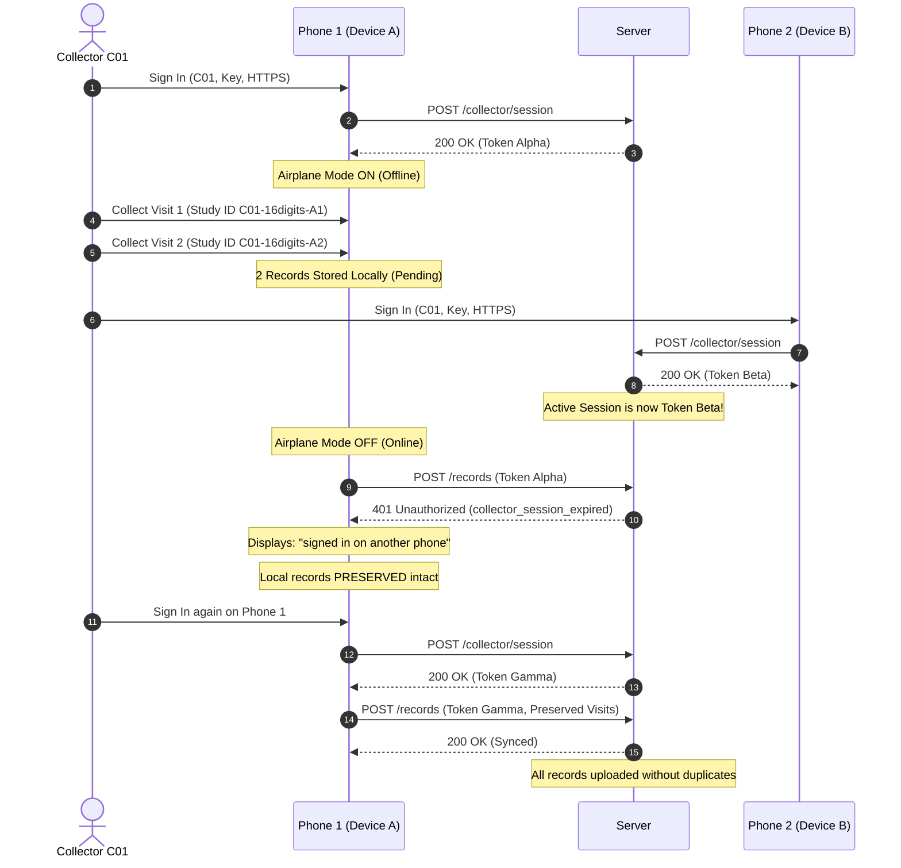

# Two-Phone Collector Handover & Session Concurrency Acceptance Test

**Target Artifact:** `study-collector-1.0.0+5.apk`  
**Test Protocol:** Multi-Device Single-Collector Handover, Session Invalidation & Collision Safety  
**Primary Objective:** Verify session arbitration, expired session detection, offline data preservation, and Study ID collision avoidance when two phones share a collector number.

---

## 1. Architecture & Background Context

In field operations, a field worker may need to switch devices (e.g. battery depletion, device handoff between team shifts, or phone replacement). To prevent concurrent conflicting writes and rogue device syncs, Nutrition Study implements **Single-Active-Session Collector Arbitration**:

1. **Session Enforcement:** Each collector number (e.g. `C01`, normalized to `C001`) maintains exactly **one active server-side session token** (`_activeSessions[collectorId] = sessionToken`).
2. **Session Takeover:** When a collector signs in on Phone 2, the server issues a new session token, immediately invalidating the token held by Phone 1.
3. **Expired Session Detection:** When Phone 1 attempts any authenticated request (`POST /records` or `GET /participants/lookup`), the server responds with **`HTTP 401 Unauthorized`** and error code `collector_session_expired`.
4. **Data Preservation Guarantee:** Upon session expiration, **Phone 1 NEVER deletes or truncates local SQLite/encrypted storage**. All collected offline records remain intact and are safely preserved in `pending` (or `failed`) state.
5. **Session Reclaim & Flush:** When the collector signs back into Phone 1, a new session token is granted, and Phone 1 flushes all preserved offline records to the server without loss.
6. **Study ID Collision Safety:** In generic release mode, each phone independently generates Study IDs using a **16-digit CSPRNG sequence** (`upper * 100000000 + lower`), yielding a state space of $9 \times 10^{15}$ unique IDs per collector. Even if both phones collect hundreds of participants offline under the same collector prefix, collision probability is virtually zero ($\approx 0$).

---

## 2. Equipment & Test Prerequisites

- **Phone 1:** Android physical device (e.g., Device A) with `study-collector-1.0.0+5.apk` installed. (The APK accepts its HTTPS server address dynamically at runtime without recompilation).
- **Phone 2:** Android physical device (e.g., Device B) with `study-collector-1.0.0+5.apk` installed.
- **Server:** Active HTTPS server (or test HTTPS proxy) configured with public mode authentication:
  - Collector Number: `1` (normalized to server identity `C001`, generating Study ID prefix `C01-`)
  - Collector Access Key: Valid 32-character hexadecimal key (e.g. `c0010101010101010101010101010101`).
- **Network Control:** Ability to toggle Airplane Mode on each phone independently.

---

## 3. Step-by-Step Test Procedure



---

### Step 1: Initial Setup & Login on Phone 1

1. Connect **Phone 1** to network.
2. Open **Study Collector** on Phone 1.
3. On Sign-In screen, input:
   - **Collector number:** `1` (numeric only)
   - **Server address:** `https://<test-domain-or-proxy>`
   - **Collector access key:** `<32-char-key-for-C001>`
4. Tap **Continue**.
5. **Verification Point 1.1:** Phone 1 logs in successfully. Collector Home Screen displays **"Hello, C001"**. Active session token `Token_Alpha` is held in Phone 1's secure storage.

---

### Step 2: Offline Data Collection on Phone 1

1. **Enable Airplane Mode** on Phone 1. Confirm device is completely disconnected from network.
2. Tap **New participant** (+ FAB).
3. Record Synthetic Visit 1:
   - **Participant Name:** `Synthetic Handover Alpha`
   - **Phone:** `+919876543220`
   - **Generated Study ID:** Record the exact 16-digit ID: `Study_ID_P1_1` (e.g. `C01-8172948291048291`).
   - Complete Step 1 and Step 2 questionnaire and measurements.
   - Tap **Review and submit**.
4. Confirm **Submission receipt** displays `Study_ID_P1_1` with `Pending` status chip.
5. Tap **Return home**. Tap **New participant** (+ FAB) again.
6. Record Synthetic Visit 2:
   - **Participant Name:** `Synthetic Handover Beta`
   - **Phone:** `+919876543221`
   - **Generated Study ID:** Record the exact 16-digit ID: `Study_ID_P1_2` (e.g. `C01-3958201948271039`).
   - Complete questionnaire and measurements.
   - Tap **Review and submit**.
7. Tap **Return home**.
8. **Verification Point 2.1:** Phone 1 Home Screen displays:
   - **Awaiting sync: 2**
   - **Recent activity:** Both visits appear with **Pending** chips.
   - Force-close Phone 1 and reopen while still offline: Both records remain present.

---

### Step 3: Session Takeover by Phone 2

1. Turn on **Phone 2** and connect it to the network.
2. Launch **Study Collector** on Phone 2.
3. On Sign-In screen, enter the **identical credentials** as Phone 1:
   - **Collector number:** `1` (numeric only)
   - **Server address:** `https://<test-domain-or-proxy>`
   - **Collector access key:** `<32-char-key-for-C001>`
4. Tap **Continue**.
5. **Verification Point 3.1:** Phone 2 signs in successfully. The server issues a new session token (`Token_Beta`) for collector `C001`, which supersedes `Token_Alpha`.
6. On Phone 2, record a visit or lookup a participant to confirm Phone 2 has an active, working session.

---

### Step 4: Expired Session Detection on Phone 1

1. Return to **Phone 1**. **Disable Airplane Mode** and connect Phone 1 to the network.
2. On Phone 1 Home Screen, tap the **Sync (Retry pending sync)** icon in the top AppBar.
3. Phone 1 transmits `POST /records` attempting to sync the 2 pending visits using its existing `Token_Alpha`.
4. The server inspects `x-local-session: Token_Alpha` against the active session token (`Token_Beta`) and rejects the request with:
   - HTTP Status: `401 Unauthorized`
   - JSON Body:
     ```json
     {
       "error": "Collector session expired. Sign in again on this phone.",
       "errorName": "collector_session_expired"
     }
     ```
5. **Verification Point 4.1 (UI String Check):** Phone 1 catches `CollectorSessionExpiredException` and immediately displays a SnackBar with the exact text:
   > **"This collector number signed in on another phone. Sign in again here to take over."**
6. **Verification Point 4.2 (Zero Data Loss Check):**
   - Inspect **Awaiting sync** on Phone 1: Still displays **2**.
   - Navigate to **My submissions** on Phone 1: Both `Synthetic Handover Alpha` and `Synthetic Handover Beta` are **STILL PRESENT**. Their status chips are marked `Pending` (or `Attention/Failed`).
   - **CRITICAL:** Confirm no records were deleted, wiped, or corrupted in Phone 1's local SQLite database.

---

### Step 5: Session Reclaim on Phone 1

1. On Phone 1, tap the **Sign out** (logout icon in AppBar) or allow the app to prompt for re-authentication.
2. Sign in again on Phone 1 using:
   - **Collector number:** `1` (numeric only)
   - **Server address:** `https://<test-domain-or-proxy>`
   - **Collector access key:** `<32-char-key-for-C001>`
3. Tap **Continue**.
4. The server issues a brand-new session token (`Token_Gamma`) for collector `C001`, making Phone 1 the active device again.
5. **Verification Point 5.1:** Collector Home Screen opens on Phone 1. The 2 offline records from Step 2 are **still queued in local storage**, showing **Awaiting sync: 2**.

---

### Step 6: Successful Sync of Preserved Records

1. On Phone 1, tap the **Sync (Retry pending sync)** icon.
2. Phone 1 uploads both records using `Token_Gamma`.
3. Server receives the records, validates collector prefix `C01-`, and successfully stores them with HTTP `200 OK`.
4. **Verification Point 6.1:**
   - Phone 1 Home Screen updates: **Awaiting sync** drops to **0**.
   - Both visit records in **Recent activity** and **My submissions** transition to **Synced** (green chip).
5. Open the Admin Web Portal (or query `GET /records`) to confirm:
   - `Synthetic Handover Alpha` exists with `Study_ID_P1_1`.
   - `Synthetic Handover Beta` exists with `Study_ID_P1_2`.
   - All questionnaire answers and physical measurements match exactly.

---

### Step 7: CSPRNG 16-Digit Study ID Collision Verification

1. Inspect the Study IDs generated across Phone 1 and Phone 2:
   - Phone 1 generated: `C01-<16 digits>`
   - Phone 2 generated: `C01-<16 digits>`
2. **Formula Verification:**
   $$\text{Study ID} = \text{"C" + colStr + "-" + } (\text{upper} \times 10^8 + \text{lower})$$
   Where:
   - $\text{upper} \in [10000000, 99999999]$ (8 digits, CSPRNG `Random.secure()`)
   - $\text{lower} \in [00000000, 99999999]$ (8 digits, CSPRNG `Random.secure()`)
   - Combined sequence has exactly 16 decimal digits.
3. **Collision Safety Mathematical Check:**
   - Total combination space per collector: $N = 9 \times 10^7 \times 10^8 = 9 \times 10^{15}$.
   - For $k = 10,000$ participants collected offline across distributed phones under collector `C01`:
     $$P(\text{collision}) \approx 1 - e^{-\frac{k^2}{2N}} = 1 - e^{-\frac{10^8}{1.8 \times 10^{16}}} \approx \frac{10^8}{1.8 \times 10^{16}} \approx 5.5 \times 10^{-9}$$
4. **Verification Point 7.1:**
   - Confirm neither Study ID collides with each other or existing server records.
   - Confirm server accepts both records without `idempotency_collision` or participant prefix errors.

---

## 4. Test Result Matrix

| Phase | Description | Result (`PASS`/`FAIL`) | Notes / Log References |
| :--- | :--- | :--- | :--- |
| **Phase 1** | Phone 1 initial login & active session | | |
| **Phase 2** | Phone 1 offline draft creation (2 visits) | | |
| **Phase 3** | Phone 2 session takeover & new token | | |
| **Phase 4** | Phone 1 401 detection & UI notification | | |
| **Phase 5** | Phone 1 offline data preservation check | | Zero records deleted |
| **Phase 6** | Phone 1 session reclaim & fresh token | | |
| **Phase 7** | Preserved records sync successfully | | |
| **Phase 8** | 16-digit CSPRNG collision check | | |
