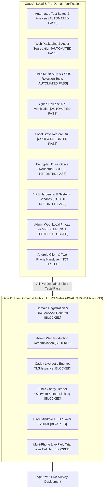

# Release Gating Matrix & Operational Checklist (Nutrition Study 1.0.0+5)

**Target Release:** Nutrition Study 1.0.0+5  
**Current Baseline Commit:** `8f170a74e8e08d11c819958b94f467f3448d56e8` (`codex/plus5-acceptance-kit`)  
**Deployment State:** Pre-Deployment Acceptance Testing Phase (Zero Real PII / Synthetic Only)  

---

## 1. Release Gating Architecture

To ensure data integrity, participant privacy, and operational stability before field rollout, the release verification is divided into two distinct gates:



---

## 2. Gate A: Local & Pre-Domain Verification

Gate A validates the software stack using local test suites, static analysis, isolated sandboxes, and secure operator SSH access to the host VPS. No public domain, DNS, or live certificates are required.

> [!WARNING]
> **CRITICAL RESTORE TEST SAFETY RULE:**  
> **NEVER run restore tests against a live production service or live study state!**  
> All backup and restore verification MUST use isolated state directories, isolated safety backup directories, and a nonexistent test service (or mocked systemctl):
> ```bash
> env VPS_SERVICE_NAME="plus5-synthetic-restore-$$" \
>     VPS_ACCOUNT="plus5-synthetic-account-$$" \
>     VPS_SAFETY_BACKUP_DIR="/tmp/test-safety" \
>     bash tool/vps/restore-state.sh <backup-dir> <isolated-target-dir>
> ```
> Running restore operations over active production state or without isolated directories risks catastrophic data loss and service disruption.

> [!IMPORTANT]
> **Operator SSH Access & Public-Mode Port Forwarding Limitations:**  
> - **Operator Account:** Use an authorized operator/admin SSH account (e.g. `ssh -L 8787:127.0.0.1:8787 <authorized-user>@<vps-ip>`) without embedding private keys or credentials. `plus5-vps` is a dedicated non-login service account (`--shell /usr/sbin/nologin`) and cannot be used for interactive SSH login.
> - **SSH Tunnel vs. Public Mode Guards:** A raw HTTP port-forwarding tunnel (`ssh -L 8787:127.0.0.1:8787`) alone **CANNOT** satisfy public-mode backend security guards:
>   * Public mode requires `X-Forwarded-Proto: https` (plain HTTP requests to port 8787 are rejected with `HTTP 403 Forbidden`).
>   * Public mode requires browser `Origin` to exactly match `LOCAL_SYNC_ALLOWED_ORIGINS` (a browser accessing `http://127.0.0.1:8086` sends an HTTP origin that fails exact HTTPS origin matching).
>   * The admin web client compiled in public mode strictly expects HTTPS.
> - **NEVER weaken production security** (e.g. adding plain HTTP origins or disabling public mode on the VPS) for testing!
> - **Valid Isolated Test Arrangements:**
>   * **Option A (Isolated Local Test Harness):** Run an isolated local test instance in non-public/private mode (`LOCAL_SYNC_PUBLIC_MODE=false` or unset) where cleartext HTTP and CORS `*` are permitted for functional UI testing. Status: `[NOT TESTED]` (ready for manual operator execution).
>   * **Option B (VPS Public Environment):** Against the production VPS where only `https://admin.<domain>` is allowed in `LOCAL_SYNC_ALLOWED_ORIGINS` and Caddy is stopped, mark the direct SSH tunnel check as `[BLOCKED]` until Gate B (domain, DNS, and TLS certificates) exists.

### Gate A Verification Matrix

| Checklist Item | Verification Command / Procedure | Expected Result | Verified State |
| :--- | :--- | :--- | :---: |
| **A.1 Automated Test Suite** | `flutter test` | **244 passed, 12 skipped, 0 failed.** Includes 64 store tests and 80 domain/sync tests verifying collector scaling ($C100, C1000$), CSPRNG study IDs, and session expiration. | `[AUTOMATED PASS]` |
| **A.2 Static Analysis** | `flutter analyze` | **No issues found!** 0 warnings, 0 errors. | `[AUTOMATED PASS]` |
| **A.3 Web Packaging Tests** | `powershell -ExecutionPolicy Bypass -File tool/tests/test_web_build_configuration.ps1` | **24 passed, 0 failed.** Admin web bundle compilation and asset segregation verified. | `[AUTOMATED PASS]` |
| **A.4 Public-Mode Auth & CORS** | Test `local_sync_server.dart` with `LOCAL_SYNC_PUBLIC_MODE=true` | Rejects legacy single keys. Enforces 32-char admin key and mapped collector credentials. Rejects wildcard CORS. | `[AUTOMATED PASS]` |
| **A.5 Signed Android APK** | Validate `study-collector-1.0.0+5.apk`:<br>`Get-FileHash -Algorithm SHA256 build/app/outputs/flutter-apk/app-release.apk` | Checksum matches exactly:<br>`1859d3afa4cef1da09987b443b9c107f20de7560cb0adc0ac05538c7f46c2982` | `[AUTOMATED PASS]` |
| **A.6 Admin Web UI Testing** | **Option A:** Test against isolated local private harness (`LOCAL_SYNC_PUBLIC_MODE=false`).<br>**Option B:** Direct SSH tunnel against production VPS (`LOCAL_SYNC_PUBLIC_MODE=true`). | Option A: Full UI functionality (listing, filtering, CSV export) operational locally.<br>Option B: Blocked by public mode HTTPS and exact origin enforcement. | Option A: `[NOT TESTED]`<br>Option B: `[BLOCKED]` |
| **A.7 Local Restore Drill** | Run `tool/vps/test-restore.sh` in isolated sandbox on Ubuntu VPS | All 35 backup/restore assertions pass (clean swap, safety backup outside target, rollback on failure). Executed against synthetic state only. | `[CODEX REPORTED PASS]` |
| **A.8 Encrypted Offsite Backup Roundtrip** | Run `tool/vps/test-offsite-backup.sh` and `tool/vps/test-encrypted-roundtrip.sh` on Ubuntu VPS | Verified on Ubuntu VPS by Codex: Google OAuth authorized, `study-crypt:` remote configured, real encrypted synthetic backup uploaded to private Google Drive, downloaded, SHA256 verified, and restored into an isolated sandbox. (Automatic timer `plus5-offsite-backup.timer` remains disabled pending USB key retention and final production activation). | `[CODEX REPORTED PASS]` |
| **A.9 VPS Firewall & Systemd Sandbox** | `sudo ufw status verbose` and systemd inspection on Ubuntu VPS | Default incoming: **DENY**. Allowed inbound: **22/tcp, 80/tcp, 443/tcp**. Port 8787 strictly internal. Service hardening verified by Codex. | `[CODEX REPORTED PASS]` |
| **A.10 Manual Android Field Checklists** | Execute `01_ANDROID_ACCEPTANCE_CHECKLIST.md` and `02_TWO_PHONE_COLLECTOR_HANDOVER_TEST.md` | Verification of UI forms, offline drafting, calculated BMI/BP, receipt persistence, and two-phone session handover. | `[NOT TESTED]` |

---

## 3. Gate B: Live Domain & Public HTTPS Gates (Requires Domain & DNS)

Gate B comprises the final operational gates that **must** be executed once the production domain is acquired and DNS records point to the host VPS. **Live survey collection is strictly forbidden until Gate B is complete.**

### Gate B Verification Matrix

| Checklist Item | Operational Action | Required Outcome | Gating Status |
| :--- | :--- | :--- | :---: |
| **B.1 DNS Configuration** | Configure DNS `A` / `AAAA` records for API and Admin subdomains:<br>- `api.YOUR-DOMAIN` -> `<VPS_IP>`<br>- `admin.YOUR-DOMAIN` -> `<VPS_IP>` | Global DNS resolves to VPS IP (`dig +short api.YOUR-DOMAIN`). | `[BLOCKED]` |
| **B.2 Admin Web Production Recompilation** | Rebuild Admin Web targeting live API:<br>`./tool/build_web_clients.ps1 -AdminOnly -PublicRelease -AdminApiBaseUrl https://api.YOUR-DOMAIN`<br>*(Note: The existing signed shared +5 APK dynamically accepts the server URL at runtime and does NOT need to be rebuilt).* | Admin web bundle compiled with production API base URL. Deployed to `/var/www/admin/`. | `[BLOCKED]` |
| **B.3 Caddy TLS Issuance** | Update `/etc/caddy/Caddyfile` with real domains. Start Caddy service:<br>`sudo systemctl enable --now caddy` | Caddy automatically obtains Let's Encrypt TLS certificates via ACME. HTTPS handshake succeeds. | `[BLOCKED]` |
| **B.4 Header Sanitization & Rate Limiting** | Inspect Caddy reverse proxy configuration. Send test requests with spoofed headers:<br>`curl -H "X-Forwarded-For: 1.2.3.4" https://api.YOUR-DOMAIN/health` | Caddy overwrites `X-Forwarded-For` with actual remote IP. Backend receives trusted client IP. Loopback rate limit not exhausted. | `[BLOCKED]` |
| **B.5 Direct Android HTTPS over Cellular** | Install existing signed shared +5 APK (`study-collector-1.0.0+5.apk`) on physical phone. Enter `https://api.YOUR-DOMAIN` in the Server address field. Disconnect from Wi-Fi; enable 4G/5G mobile data. | App connects directly to `https://api.YOUR-DOMAIN`, logs in collector, and uploads visit without VPN or tunnel. | `[BLOCKED]` |
| **B.6 Multi-Phone Live Trial over Cellular** | Execute `tool/acceptance/02_TWO_PHONE_COLLECTOR_HANDOVER_TEST.md` across two physical phones over cellular data. | Handover detects 401, alerts user, preserves local records, and flushes on re-login without duplicates. | `[BLOCKED]` |

---

## 4. Release Decision Gate Criteria

```text
IF Gate A automated checks [AUTOMATED PASS], Codex VPS checks [CODEX REPORTED PASS],
   manual client/admin checklists [MANUAL PASS], AND Gate B live gates [MANUAL PASS]:
    STATUS = APPROVED FOR LIVE STUDY ENROLLMENT
ELSE:
    STATUS = BLOCKED (Hold for prerequisites / pending manual testing / defect resolution)
```

### Current Verification Status Summary

- **Worktree Automated Tests:** `[AUTOMATED PASS]` (244 regression, 64 store, 80 domain/sync, 24 web packaging, flutter analyze).
- **Ubuntu VPS Hardening & Encrypted Backup:** `[CODEX REPORTED PASS]` (verified on VPS by Codex: systemd sandbox, firewall rules, encrypted Drive roundtrip; timers disabled).
- **Manual Android & Admin Web Checklists:** `[NOT TESTED]` (awaiting manual operator execution on physical devices and browser).
- **Public VPS Admin Tunnel & Gate B Live Deployment:** `[BLOCKED]` (blocked pending domain, DNS, and TLS certificates).

*Gate A as a whole is NOT 100% verified while manual browser/device checks remain unexecuted.*

### Sign-Off Approvals

| Authority | Name | Date | Signature |
| :--- | :--- | :--- | :--- |
| **Acceptance Kit Author** | | | |
| **Lead DevOps / Security Engineer** | | | |
| **Study Principal Investigator** | | | |
