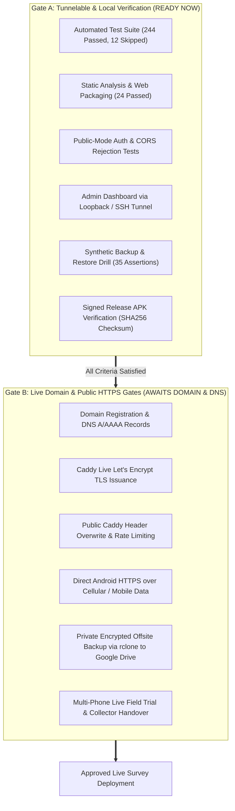

# Release Gating Matrix & Operational Checklist (Nutrition Study 1.0.0+5)

**Target Release:** Nutrition Study 1.0.0+5  
**Current Baseline Commit:** `8f170a74e8e08d11c819958b94f467f3448d56e8` (`codex/plus5-acceptance-kit`)  
**Deployment State:** Pre-Deployment Acceptance Testing Phase (Zero Real PII / Synthetic Only)  

---

## 1. Release Gating Architecture

To ensure data integrity, participant privacy, and operational stability before field rollout, the release verification is divided into two distinct gates:



---

## 2. Gate A: Tunnelable & Local Verification (Ready Now)

Gate A validates the entire software stack using local emulation, Docker/WSL, or secure SSH port forwarding to the host VPS (`ssh -L 8787:127.0.0.1:8787 plus5-vps@<vps-ip>`). No public domain, DNS, or live certificates are required.

### Gate A Verification Matrix

| Checklist Item | Verification Command / Procedure | Expected Result | Verified State |
| :--- | :--- | :--- | :---: |
| **A.1 Automated Test Suite** | `flutter test` | **244 passed, 12 skipped, 0 failed.** Tests verify collector scaling ($C100, C1000$), CSPRNG study IDs, and session expiration. | `[AUTOMATED PASS]` |
| **A.2 Static Analysis** | `flutter analyze` | **No issues found!** 0 warnings, 0 errors. | `[AUTOMATED PASS]` |
| **A.3 Web Packaging Tests** | `powershell -ExecutionPolicy Bypass -File tool/tests/test_web_build_configuration.ps1` | **24 passed, 0 failed.** Admin web bundle compilation and asset segregation verified. | `[AUTOMATED PASS]` |
| **A.4 Public-Mode Auth & CORS** | Test `local_sync_server.dart` with `LOCAL_SYNC_PUBLIC_MODE=true` | Rejects legacy single keys. Enforces 32-char admin key and mapped collector credentials. Rejects wildcard CORS. | `[AUTOMATED PASS]` |
| **A.5 Signed Android APK** | Validate `study-collector-1.0.0+5.apk`:<br>`Get-FileHash -Algorithm SHA256 build/app/outputs/flutter-apk/app-release.apk` | Checksum matches exactly:<br>`1859d3afa4cef1da09987b443b9c107f20de7560cb0adc0ac05538c7f46c2982` | `[AUTOMATED PASS]` |
| **A.6 Admin Web over SSH Tunnel** | Forward remote port 8787:<br>`ssh -L 8787:127.0.0.1:8787`<br>Serve admin web on `http://127.0.0.1:8086` | Admin dashboard logs in with admin key, loads synthetic records, filters, and copies CSV cleanly. | `[READY TO RUN]` |
| **A.7 Backup & Restore Drill** | Run `tool/vps/test-backup-restore.sh` on Ubuntu VPS | All 35 backup/restore assertions pass. State preserves record JSON and conflict reports. | `[AUTOMATED PASS]` |
| **A.8 VPS Firewall Hardening** | `sudo ufw status verbose` on Ubuntu VPS | Default incoming: **DENY**. Allowed inbound: **22/tcp, 80/tcp, 443/tcp**. Port 8787 is strictly internal. | `[AUTOMATED PASS]` |

---

## 3. Gate B: Live Domain & Public HTTPS Gates (Requires Domain & DNS)

Gate B comprises the final operational gates that **must** be executed once the production domain is acquired and DNS records point to the host VPS. **Live survey collection is strictly forbidden until Gate B is 100% complete.**

### Gate B Verification Matrix

| Checklist Item | Operational Action | Required Outcome | Gating Status |
| :--- | :--- | :--- | :---: |
| **B.1 DNS Configuration** | Configure DNS `A` / `AAAA` records for API and Admin subdomains:<br>- `api.YOUR-DOMAIN` -> `<VPS_IP>`<br>- `admin.YOUR-DOMAIN` -> `<VPS_IP>` | Global DNS resolves to VPS IP (`dig +short api.YOUR-DOMAIN`). | `[PENDING DOMAIN]` |
| **B.2 Production Asset Recompilation** | Rebuild Admin Web & Android APK with real domain:<br>`./tool/build_web_clients.ps1 -AdminOnly -PublicRelease -AdminApiBaseUrl https://api.YOUR-DOMAIN -NoPub`<br>`./tool/package_android_release.ps1 -BuildNumber 5 -PublicRelease -LocalApiBaseUrl https://api.YOUR-DOMAIN -SigningBackupConfirmed -NoPub` | Build succeeds. Admin web targets real API; APK embeds real HTTPS base URL and enforces HTTPS. | `[PENDING DOMAIN]` |
| **B.3 Caddy TLS Issuance** | Update `/etc/caddy/Caddyfile` with real domains. Start Caddy service:<br>`sudo systemctl enable --now caddy` | Caddy automatically obtains Let's Encrypt TLS certificates via ACME. HTTPS handshake succeeds. | `[PENDING DOMAIN]` |
| **B.4 Header Sanitization & Rate Limiting** | Inspect Caddy reverse proxy configuration. Send test requests with spoofed headers:<br>`curl -H "X-Forwarded-For: 1.2.3.4" https://api.YOUR-DOMAIN/health` | Caddy overwrites `X-Forwarded-For` with actual remote IP. Backend receives trusted client IP. Loopback rate limit not exhausted. | `[PENDING DOMAIN]` |
| **B.5 Direct Android HTTPS over Cellular** | Install recompiled APK on physical phone. Disconnect from Wi-Fi; enable 4G/5G mobile data. | App connects directly to `https://api.YOUR-DOMAIN`, logs in collector, and uploads visit without VPN or tunnel. | `[PENDING DOMAIN]` |
| **B.6 Google Drive Offsite Encrypted Backup** | Follow `tool/vps/OFFSITE_BACKUP_SETUP.md`:<br>1. Authorize `rclone` for Google Drive (`15d5eERaJkkGFy96c_MmucG3Lx3GZr3zG`).<br>2. Configure `crypt` overlay.<br>3. Enable systemd morning backup timer.<br>4. Run test backup and verify isolated restore. | Encrypted backup uploaded to private Drive. Test restore in clean temporary sandbox succeeds. | `[PENDING DOMAIN]` |
| **B.7 Multi-Phone Live Trial** | Execute `tool/acceptance/02_TWO_PHONE_COLLECTOR_HANDOVER_TEST.md` across two physical phones over cellular data. | Handover detects 401, alerts user, preserves local records, and flushes on re-login without duplicates. | `[PENDING DOMAIN]` |

---

## 4. Release Decision Gate Criteria

```text
IF Gate A == 100% PASS AND Gate B == 100% PASS:
    STATUS = APPROVED FOR LIVE STUDY ENROLLMENT
ELSE:
    STATUS = BLOCKED (Hold for prerequisites / defect resolution)
```

### Sign-Off Approvals

| Authority | Name | Date | Signature |
| :--- | :--- | :--- | :--- |
| **Acceptance Kit Author** | | | |
| **Lead DevOps / Security Engineer** | | | |
| **Study Principal Investigator** | | | |
