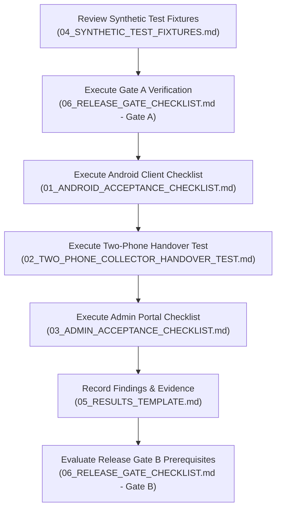

# Nutrition Study 1.0.0+5 Acceptance Testing Kit

**Release Version:** `1.0.0+5`  
**Git Baseline Commit:** `8f170a74e8e08d11c819958b94f467f3448d56e8`  
**Branch:** `codex/plus5-acceptance-kit`  
**Primary APK Checksum (SHA256):** `1859d3afa4cef1da09987b443b9c107f20de7560cb0adc0ac05538c7f46c2982`  
**Author:** Acceptance Kit Author  

---

## 1. Executive Summary

This directory contains the complete, grounded, and standardized **Acceptance Test Kit** for the **Nutrition Study 1.0.0+5** release. The kit provides comprehensive, reproducible verification protocols for the mobile collector client, administrative portal, server-side data synchronization, multi-device collector handovers, and release gating criteria.

> [!CAUTION]
> **Strict Synthetic Data Policy:**  
> All fixtures, phone numbers, participant names, and credentials within this kit are **100% fictional and synthetic**. Real participant records, authentic PII, and production access keys must **never** be entered during acceptance verification or committed to source control.

---

## 2. Directory Navigation & Kit Structure

| Document | Primary Focus | Target Audience |
| :--- | :--- | :--- |
| **[01_ANDROID_ACCEPTANCE_CHECKLIST.md](01_ANDROID_ACCEPTANCE_CHECKLIST.md)** | Step-by-step checklist for the Android collector app. Covers HTTPS URL enforcement, offline drafting, physical measurements, BMI and average BP formulas, missing reasons, receipt verification, app restarts, reconnection sync, and idempotency. | Android QA Engineers, Field Coordinators |
| **[02_TWO_PHONE_COLLECTOR_HANDOVER_TEST.md](02_TWO_PHONE_COLLECTOR_HANDOVER_TEST.md)** | Protocol for two-phone collector handover. Validates single active session arbitration, HTTP 401 session expiration, zero offline data loss, session reclaim, sync of preserved records, and 16-digit CSPRNG Study ID collision safety. | Systems QA, Backend Engineers |
| **[03_ADMIN_ACCEPTANCE_CHECKLIST.md](03_ADMIN_ACCEPTANCE_CHECKLIST.md)** | Checklist for the Administrator Web Portal. Covers exact CORS origin enforcement, status filtering, record search, detailed inspection of calculated vs missing metrics, CSV export format, and questionnaire preservation during admin edits. | Data Managers, Compliance Officers |
| **[04_SYNTHETIC_TEST_FIXTURES.md](04_SYNTHETIC_TEST_FIXTURES.md)** | Fictional test profiles (Alpha, Beta, Gamma, Delta) and 32-character hexadecimal credential templates. Documents unlimited participant capacity and collector number scaling beyond 99. | Test Operators, Automation Engineers |
| **[05_RESULTS_TEMPLATE.md](05_RESULTS_TEMPLATE.md)** | Standardized results capture template using `[AUTOMATED PASS]`, `[MANUAL PASS]`, `[NOT TESTED]`, and `[BLOCKED]` indicators. Includes environment capture tables, evidence log, and sign-off blocks. | QA Leads, Acceptance Auditors |
| **[06_RELEASE_GATE_CHECKLIST.md](06_RELEASE_GATE_CHECKLIST.md)** | Release gating matrix dividing verification into Gate A (Tunnelable/Local, ready now) and Gate B (Public HTTPS & Domain, awaits DNS and domain acquisition). | Release Managers, DevOps, PI |

---

## 3. Recommended Execution Workflow

To perform a complete acceptance audit of Nutrition Study 1.0.0+5, follow this sequential pathway:

1. **Step 1: Setup & Grounding:** Read `04_SYNTHETIC_TEST_FIXTURES.md` to understand expected participant profiles and calculation formulas.
2. **Step 2: Gate A Confirmation:** Confirm all automated tests pass (244 passed, 12 skipped) and static analysis is clean.
3. **Step 3: Android Verification:** Follow `01_ANDROID_ACCEPTANCE_CHECKLIST.md` on a physical Android device, validating offline persistence and calculated fields.
4. **Step 4: Multi-Device Verification:** Run `02_TWO_PHONE_COLLECTOR_HANDOVER_TEST.md` using two phones to verify session arbitration and collision avoidance.
5. **Step 5: Admin Web Verification:** Run `03_ADMIN_ACCEPTANCE_CHECKLIST.md` to verify browser CORS, search, CSV export, and note editing.
6. **Step 6: Document Audit Trail:** Fill out `05_RESULTS_TEMPLATE.md` with screenshot references, log hashes, and signatures.
7. **Step 7: Pre-Deployment Sign-Off:** Review `06_RELEASE_GATE_CHECKLIST.md` to confirm system readiness for Gate B (domain and live HTTPS activation).

---

## 4. Key Implementation Facts for Auditors

- **Calculated BMI Formula:**  
  $$\text{BMI} = \frac{\text{Weight (kg)}}{(\text{Height (cm)} / 100)^2}$$  
  Rounded to **1 decimal place** in the UI (e.g. $170\text{ cm}, 68\text{ kg} \implies 23.5$). If either height or weight is missing, BMI is `null` (`Not calculated` in client, `Not recorded` in admin).
- **Average Blood Pressure Formula:**  
  $$\text{Systolic}_{\text{avg}} = \frac{S_1 + S_2}{2}, \quad \text{Diastolic}_{\text{avg}} = \frac{D_1 + D_2}{2}$$  
  Formatted as `${S} / ${D}\text{ mmHg}`. If either reading is missing, Average BP is `null`.
- **Missing Measurement Statuses:**  
  Explicitly coded as `'unable'` or `'declined'`. In CSV exports, numeric columns are empty strings `""`, and reason columns (e.g. `ncd_height_missing_reason`) contain the reason text.
- **Study ID Structure:**  
  In generic release mode: `C<col>-<16 digits>`, generated via secure CSPRNG sequence (`upper * 100000000 + lower`). Provides $9 \times 10^{15}$ collision-free combinations per collector.
- **Idempotency Guarantee:**  
  Upload retries for an existing record ID and matching `idempotencyKey` return HTTP `200 OK` with the existing record, without incrementing `revision` or creating duplicate rows.
- **CORS Enforcement:**  
  Public mode requires `LOCAL_SYNC_ALLOWED_ORIGINS` with exact HTTPS origins. Wildcard origins (`*`) and cleartext HTTP are strictly prohibited.
